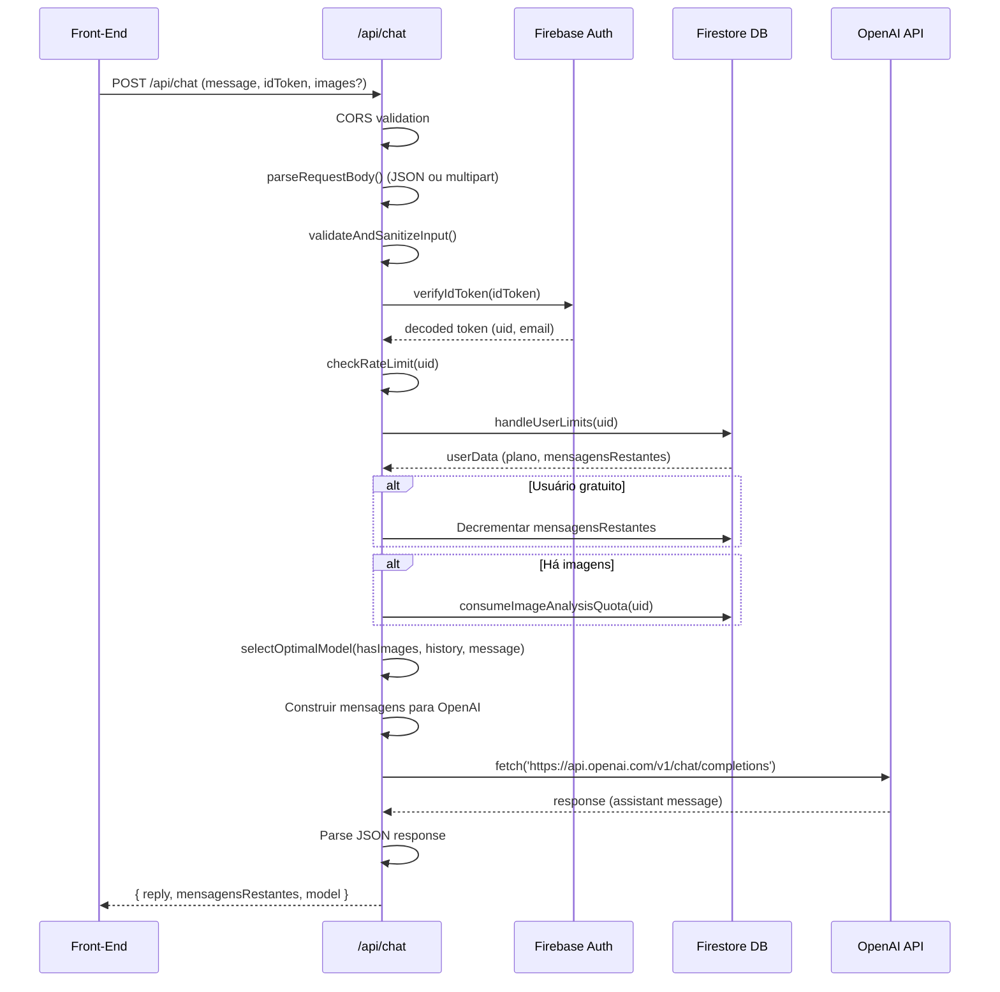

# 📊 AUDITORIA TÉCNICA COMPLETA: SISTEMA DE CHATBOT E INTEGRAÇÃO COM ANÁLISE DE MIXAGEM

**Data:** 22 de outubro de 2025  
**Objetivo:** Mapear completamente o sistema atual antes de implementar melhorias  
**Status:** ⚠️ SOMENTE ANÁLISE - NENHUMA ALTERAÇÃO REALIZADA

---

## 📁 1. FILES & ENTRY POINTS

### 1.1 Arquivos Back-End (API)

#### **`/api/chat.js`** (Endpoint principal do chatbot)
- **Função:** Handler principal para processar mensagens do chat
- **Localização:** `c:\Users\DJ Correa\Desktop\Programação\SoundyAI\api\chat.js`
- **Framework:** Vercel Serverless Functions
- **Dependências:**
  - `firebase-admin` (autenticação e Firestore)
  - `formidable` (parse de multipart/form-data)
  - `cors` (gerenciamento de CORS)
  - OpenAI API (via fetch)

**Principais funcionalidades:**
- Autenticação via Firebase Auth (verifyIdToken)
- Parse de requisições JSON e multipart (suporte a imagens)
- Rate limiting (Map em memória, limite: 10 req/min)
- Validação de imagens (magic bytes, tamanho, formato)
- Gestão de limites de usuário (mensagens diárias, quota de imagens)
- Seleção inteligente de modelo GPT (3.5-turbo vs 4o)
- Envio de mensagens para OpenAI API
- Sistema de cache de respostas (Map em memória, TTL 5min)

#### **`/api/firebaseAdmin.js`**
- **Função:** Inicialização do Firebase Admin SDK
- **Exports:** `auth`, `db` (Firestore)

#### **`/api/chat-with-images.js`**
- **Função:** Endpoint dedicado para mensagens com imagens (pode ser redundante)
- **Status:** Parece duplicado do `/api/chat.js`

---

### 1.2 Arquivos Front-End

#### **`/public/chat.js`** (Lógica do chat no front-end)
- **Função:** Funções de autenticação Firebase no cliente
- **Exports:**
  - `auth` (Firebase Auth)
  - `waitForFirebase()`
  - Funções de login/logout

#### **`/public/script.js`** (Orquestração principal)
- **Função:** Script principal que gerencia toda a interface do chatbot
- **Tamanho:** 1907 linhas
- **Componentes principais:**
  - `API_CONFIG` - configuração de endpoints
  - `ProdAIChatbot` - classe principal do chatbot
  - `processMessage()` - função que envia mensagens para a API
  - `appendMessage()` - renderização de mensagens
  - Efeitos visuais (Vanta.js, GSAP)

**Estrutura da classe ProdAIChatbot:**
```javascript
class ProdAIChatbot {
  - isActive: boolean (estado do chat)
  - messageCount: number
  - welcomeState / activeState (elementos do DOM)
  - mainInput / activeInput (campos de texto)
  - conversationHistory: array (histórico de mensagens)
  
  Métodos principais:
  - activateChat(message, images) - ativa o chat com primeira mensagem
  - sendMessage() - envia mensagem no modo ativo
  - addMessage(text, sender, images) - adiciona mensagem ao histórico
  - showTyping() / hideTyping() - indicadores visuais
}
```

#### **`/public/audio-analyzer-integration.js`**
- **Função:** Integração entre o sistema de análise de áudio e o chatbot
- **Tamanho:** 8582 linhas
- **Funções chave:**
  - `openAudioModal()` - abre modal de análise
  - `sendModalAnalysisToChat()` - **PONTO DE INTEGRAÇÃO CRÍTICO**
  - `closeAudioModal()` - fecha modal

#### **`/public/audio-analyzer.js`**
- **Função:** Classe principal do analisador de áudio
- **Tamanho:** 7203 linhas
- **Classe:** `AudioAnalyzer`
- **Método crítico:** `generateAIPrompt(analysis)` - gera prompt para IA

#### **`/public/index.html`**
- **Função:** Estrutura HTML principal
- **Contém:**
  - Estrutura do chatbot (welcome state + active state)
  - Modais (análise de áudio, seleção de gênero, boas-vindas)
  - Carregamento de bibliotecas (Three.js, Vanta.js, GSAP, Firebase)
  - Carregamento de ~40 scripts especializados

---

## 🔄 2. DATA FLOW (BACK-END)

### 2.1 Recebimento da Requisição

**Entrada:** POST request para `/api/chat`

**Headers aceitos:**
- `Content-Type: application/json` (mensagens texto)
- `Content-Type: multipart/form-data` (mensagens com imagens)

**Campos da requisição:**
- `message`: string (obrigatório, max 2000 chars)
- `conversationHistory`: array ou string JSON (últimas 5 mensagens)
- `idToken`: string (token Firebase Auth)
- `images`: array de arquivos (opcional, max 3)

### 2.2 Pipeline de Processamento



### 2.3 Detecção de Intent (Atual)

**⚠️ IMPORTANTE:** O sistema atual **NÃO** possui detecção de intents específica.

**Lógica de decisão:**
1. **Presença de imagens** → força GPT-4o
2. **Análise de complexidade** → calcula score baseado em:
   - Tamanho da mensagem (>500 chars → +2 pontos)
   - Contagem de palavras (>100 → +2 pontos)
   - Termos técnicos (`analis|interpreta|desenvol|implement` → +3 pontos)
   - Presença de código (``` ou keywords → +2 pontos)
   - Follow-up de análise de imagem recente (→ +4 pontos)

**Threshold:** Se `complexityScore >= GPT4_COMPLEXITY_THRESHOLD` → usa GPT-4o, senão GPT-3.5-turbo

**System Prompts:**
- `SYSTEM_PROMPTS.imageAnalysis` - para mensagens com imagens
- `SYSTEM_PROMPTS.default` - para mensagens texto

**Limitação atual:** Não há detecção específica de "mix_analyzer_help" ou similar. Todas as mensagens são tratadas como conversa genérica musical.

### 2.4 Construção do Objeto de Análise

**Quando o usuário clica em "Pedir ajuda ao chat" no modal de análise:**

1. Front-end chama `sendModalAnalysisToChat()` em `audio-analyzer-integration.js`
2. Função busca `currentModalAnalysis` (objeto global)
3. Chama `window.audioAnalyzer.generateAIPrompt(analysis)`
4. Gera um prompt estruturado:

```javascript
// Estrutura do prompt gerado
{
  texto: "🎵 ANÁLISE DE ÁUDIO - Preciso de ajuda...",
  métricas: {
    peak: -0.5,
    rms: -14.2,
    dynamicRange: 8.5,
    lufsIntegrated: -14.0,
    truePeakDbtp: -0.3,
    // ... outras
  },
  score: 85,
  classification: "Profissional",
  suggestions: [...],
  problems: [...]
}
```

**Formato do prompt:**
- Cabeçalho textual amigável
- Métricas em linha compacta
- Frequências dominantes (top 3)
- Lista de problemas críticos
- Lista de sugestões principais
- **Bloco JSON estruturado** (entre `### JSON_DATA` e `### END_JSON`)

### 2.5 Construção de System Prompt + User Prompt

**System Prompt (SYSTEM_PROMPTS.default):**
```
Você é o PROD.AI 🎵, um especialista master EXCLUSIVAMENTE em produção musical e áudio.

🎯 REGRAS FUNDAMENTAIS:
- RESPONDA APENAS sobre música, produção musical, áudio, instrumentos e temas relacionados
- Se perguntarem sobre qualquer outro assunto (café, receitas, programação, etc.), responda: "🎵 Sou especializado apenas em produção musical! Como posso ajudar com sua música hoje? Quer dicas de mixagem, mastering, ou algum desafio específico na sua produção?"
- SEMPRE redirecione conversas não-musicais para o contexto musical
- Seja direto, técnico e preciso em todas as respostas musicais
- Use valores específicos: frequências exatas (Hz), faixas dinâmicas (dB), tempos (ms)
- Mencione equipamentos, plugins e técnicas por nome
- Forneça parâmetros exatos quando relevante

🛠️ ESPECIALIDADES TÉCNICAS EXCLUSIVAS:
- Mixagem: EQ preciso, compressão dinâmica, reverb/delay, automação
- Mastering: Limiters, maximizers, análise espectral, LUFS, headroom
- Sound Design: Síntese, sampling, modulação, efeitos
- Arranjo: Teoria musical aplicada, harmonias, progressões
- Acústica: Tratamento de sala, posicionamento de monitores
- Workflow: Técnicas de produção rápida e eficiente
- Géneros: Funk, trap, sertanejo, eletrônica, rock, etc.

📋 FORMATO OBRIGATÓRIO (apenas para temas musicais):
- Use emojis relevantes no início de cada parágrafo
- Apresente valores técnicos quando aplicável
- Finalize sempre com uma dica prática

🚫 TEMAS PROIBIDOS: Qualquer assunto não relacionado à música/áudio.

Seja um especialista musical absoluto e exclusivo.
```

**User Prompt:**
- Se for análise de áudio: prompt gerado por `generateAIPrompt()`
- Se for mensagem normal: texto do usuário

**Histórico de conversa:**
- Mantém últimas 5 mensagens (slice(-5))
- Formato: `{ role: 'user' | 'assistant', content: string }`

### 2.6 Envio para OpenAI API

**Endpoint:** `https://api.openai.com/v1/chat/completions`

**Payload:**
```javascript
{
  model: "gpt-3.5-turbo" | "gpt-4o",
  messages: [
    { role: "system", content: SYSTEM_PROMPTS.default },
    ...conversationHistory, // últimas 5 mensagens
    { 
      role: "user", 
      content: hasImages ? [
        { type: "text", text: message },
        { type: "image_url", image_url: { url: "data:image/jpeg;base64,...", detail: "high" } }
      ] : message
    }
  ],
  max_tokens: hasImages ? 1500 : (model === 'gpt-4o' ? MAX_TEXT_RESPONSE_TOKENS : 1000),
  temperature: 0.7 | 0.8
}
```

**Headers:**
```javascript
{
  'Authorization': `Bearer ${process.env.OPENAI_API_KEY}`,
  'Content-Type': 'application/json'
}
```

**Timeout configurável:**
- Imagens: 180 segundos
- GPT-4o: 120 segundos
- GPT-3.5-turbo: 60 segundos

### 2.7 Retorno para Front-End

**Resposta de sucesso:**
```json
{
  "reply": "🎵 Analisando seu mix...",
  "mensagensRestantes": 7,
  "model": "gpt-3.5-turbo"
}
```

Se houver imagens:
```json
{
  "reply": "...",
  "model": "gpt-4o",
  "imageAnalysis": {
    "quotaUsed": 3,
    "quotaLimit": 5,
    "quotaRemaining": 2,
    "planType": "gratis"
  }
}
```

**Resposta de erro:**
```json
{
  "error": "DAILY_LIMIT_EXCEEDED",
  "message": "Limite diário de mensagens atingido"
}
```

---

## 🧑‍💻 3. FRONT-END FLOW

### 3.1 Trigger do Chat via "Pedir Ajuda ao Chat"

**Caminho completo:**

1. **Usuário clica em "Analisar Mixagem"**
   - Localização: Botão no estado welcome do chatbot ou menu popover "+"
   - Handler: `openAudioModal()`
   - Efeito: Abre `#audioAnalysisModal`

2. **Usuário faz upload do áudio**
   - Input file: `#modalAudioFileInput`
   - Processamento: Web Audio API → AudioAnalyzer
   - Resultado armazenado: `window.currentModalAnalysis`

3. **Sistema renderiza resultados**
   - Container: `#audioAnalysisResults`
   - Componentes:
     - Score final
     - Dados técnicos (cards de métricas)
     - Sugestões (via sistema unificado ou IA)
     - Botão "Pedir Ajuda à IA"

4. **Usuário clica em "Pedir Ajuda à IA"**
   - Handler: `sendModalAnalysisToChat()` (linha 7465 do audio-analyzer-integration.js)
   - **Código exato:**

```javascript
window.sendModalAnalysisToChat = async function sendModalAnalysisToChat() {
    if (!currentModalAnalysis) {
        alert('Nenhuma análise disponível');
        return;
    }
    
    try {
        // Gerar prompt personalizado
        const prompt = window.audioAnalyzer.generateAIPrompt(currentModalAnalysis);
        const message = `🎵 Analisei meu áudio e preciso de ajuda para melhorar. Aqui estão os dados técnicos:\n\n${prompt}`;
        
        // Método 1: Usar diretamente o ProdAI Chatbot
        if (window.prodAIChatbot) {
            if (!window.prodAIChatbot.isActive) {
                // Chat inativo: ativar com primeira mensagem
                await window.prodAIChatbot.activateChat(message);
                showTemporaryFeedback('🎵 Análise enviada para o chat!');
                closeAudioModal();
            } else {
                // Chat já ativo: preencher input e enviar
                const activeInput = document.getElementById('chatbotActiveInput');
                if (activeInput) {
                    activeInput.value = message;
                    activeInput.focus();
                    await window.prodAIChatbot.sendMessage();
                    showTemporaryFeedback('🎵 Análise enviada para o chat!');
                    closeAudioModal();
                }
            }
        }
        // Método 2: Fallback via DOM manipulation
        else {
            const input = document.getElementById('chatbotActiveInput') || document.getElementById('chatbotMainInput');
            const sendBtn = document.getElementById('chatbotActiveSendBtn') || document.getElementById('chatbotSendButton');
            
            if (input && sendBtn) {
                input.value = message;
                input.focus();
                input.dispatchEvent(new Event('input', { bubbles: true }));
                
                setTimeout(() => {
                    sendBtn.click();
                    showTemporaryFeedback('🎵 Análise enviada para o chat!');
                    closeAudioModal();
                }, 500);
            }
        }
        
    } catch (error) {
        console.error('❌ Erro ao enviar análise para chat:', error);
        showTemporaryFeedback('❌ Erro ao enviar análise. Tente novamente.');
    }
}
```

5. **Chat processa a mensagem**
   - Se chat inativo: `activateChat(message)` → transição visual + primeira mensagem
   - Se chat ativo: `sendMessage()` → adiciona mensagem ao histórico
   - Dispara `processMessage(message)` → envia para back-end

### 3.2 Renderização da Resposta

**Função:** `appendMessage(content, className)` em script.js

**Estrutura do DOM:**
```html
<div class="chatbot-message chatbot-message-assistant">
  <div class="chatbot-message-content">
    <div class="chatbot-message-bubble ia-response">
      <!-- Texto da resposta com efeito de digitação -->
    </div>
    <div class="chatbot-message-timestamp">14:32</div>
  </div>
</div>
```

**Efeito de digitação:**
- Implementado por `startTypingEffect(bubble, content, messageDiv)`
- Velocidade: caractere por caractere
- Scroll automático durante digitação

**Indicador de "digitando":**
- Elemento: `#chatbotTypingIndicator`
- Animação: 3 pontos pulsantes
- Removido quando resposta chega

### 3.3 Componentes UI

**Estados do chatbot:**

1. **Welcome State** (`#chatbotWelcomeState`)
   - Robô animado
   - Título "SoundyAI"
   - Input principal
   - Botão de envio

2. **Active State** (`#chatbotActiveState`)
   - Header bar com "SoundyAI - Seu mentor virtual"
   - Área de conversa scrollable
   - Input ativo
   - Indicador de digitação

**Botões de ação:**
- "Assinar versão Plus" → redireciona para `planos.html`
- "Gerenciar conta" → redireciona para `gerenciar.html`
- "Sair" → `logout()` → limpa localStorage → redireciona para `login.html`

### 3.4 Limitações Atuais

**Hardcoded no front-end:**
- Limite de 10 mensagens diárias para usuários gratuitos (exibido na UI)
- Máximo 3 imagens por mensagem
- Tamanho máximo de imagem: 10MB
- Payload total: 30MB
- Histórico: últimas 5 mensagens

**UI não adaptativa:**
- Não diferencia visualmente mensagens de análise vs conversa normal
- Não há indicador de qual modelo GPT foi usado
- Não há opção para "retry" em caso de erro (exceto em timeouts)

---

## 🧠 4. CONTEXT & STATE MANAGEMENT

### 4.1 Armazenamento de Dados do Usuário

**Firebase Firestore:**
- Collection: `usuarios`
- Document ID: `uid` (Firebase Auth)

**Schema do documento:**
```javascript
{
  uid: string,
  email: string,
  plano: "gratis" | "plus" | "pro",
  mensagensRestantes: number, // 0-10 para gratuitos
  dataUltimoReset: Timestamp,
  createdAt: Timestamp,
  
  // Cota de análise de imagens (mensal)
  imagemAnalises: {
    usadas: number,
    limite: number, // 5 para gratis, 20 para plus
    mesAtual: number,
    anoAtual: number,
    resetEm: Timestamp
  },
  
  // Dados do plano Plus
  isPlus: boolean,
  planExpiresAt: Timestamp,
  planExpiredAt: Timestamp,
  previousPlan: string,
  
  // Perfil do usuário (interview)
  perfil: {
    daw: string, // "FL Studio", "Ableton", etc.
    generoPreferido: string,
    nivelExperiencia: string,
    // ... outros campos do questionário
  }
}
```

**Transações automáticas:**
- Reset diário de `mensagensRestantes` (verifica `dataUltimoReset`)
- Reset mensal de `imagemAnalises` (verifica `mesAtual` e `anoAtual`)
- Verificação de expiração de plano Plus (se `planExpiresAt` < now → downgrade para "gratis")

### 4.2 Acesso no Back-End

**Função:** `handleUserLimits(db, uid, email)` em `/api/chat.js`

**Fluxo:**
1. Busca documento do usuário no Firestore
2. Se não existe: cria com valores padrão
3. Verifica data do último reset
4. Verifica expiração de plano Plus
5. Se plano gratuito: decrementa `mensagensRestantes`
6. Retorna `userData` completo

**Acesso ao perfil:**
```javascript
const userData = await handleUserLimits(db, uid, email);
const userProfile = userData.perfil; // { daw: "...", generoPreferido: "..." }
```

### 4.3 Acesso no Front-End

**LocalStorage:**
```javascript
localStorage.getItem("user"); // JSON string: { uid, email }
localStorage.getItem("idToken"); // Firebase ID Token
```

**Firebase Client:**
```javascript
const currentUser = window.auth.currentUser;
// currentUser.uid
// currentUser.email
```

**Estado global:**
```javascript
window.prodAIChatbot.isActive // boolean
window.conversationHistory // array de mensagens
window.currentModalAnalysis // objeto da análise de áudio
```

### 4.4 Diferenciação de Usuários

**No back-end:**
- Plano detectado via `userData.plano`
- Mensagens ilimitadas para "plus" e "pro"
- Limite de 10/dia para "gratis"
- Cota de imagens: 5/mês (gratis) vs 20/mês (plus)

**No front-end:**
- Exibição de `mensagensRestantes` apenas para usuários gratuitos
- Botão "Assinar versão Plus" sempre visível
- Link para upgrade ao atingir limite

**⚠️ PROBLEMA:** O sistema atualmente **NÃO** passa o DAW ou outras informações do perfil para o contexto do chat. Essas informações estão disponíveis no Firestore mas não são utilizadas nos prompts.

---

## 📝 5. PROMPT CONSTRUCTION & TOKEN CONTROL

### 5.1 Construção de Prompts

**Estrutura de mensagens enviadas para OpenAI:**

```javascript
[
  {
    role: "system",
    content: SYSTEM_PROMPTS.imageAnalysis || SYSTEM_PROMPTS.default
  },
  ...conversationHistory, // últimas 5 mensagens
  {
    role: "user",
    content: message // ou array com texto + imagens
  }
]
```

**System Prompt padrão:** (~800 tokens)
- Identidade: "PROD.AI 🎵, especialista master EXCLUSIVAMENTE em produção musical"
- Regras fundamentais (responder apenas sobre música)
- Especialidades técnicas (mixagem, mastering, sound design, etc.)
- Formato obrigatório (emojis, valores técnicos, dica final)
- Temas proibidos

**System Prompt para imagens:** (~600 tokens)
- Identidade mantida
- Instruções específicas para análise visual de DAWs, plugins, waveforms
- Lista de elementos a identificar (EQ, compressor, espectrograma, etc.)
- Formato de resposta com valores técnicos exatos
- Rejeição de imagens não musicais

**User Prompt de análise:**
- Cabeçalho: "🎵 ANÁLISE DE ÁUDIO - Preciso de ajuda..."
- Métricas em linha: "Peak: -0.5dB | RMS: -14.2dB | DR: 8.5dB | ..."
- Frequências dominantes: "250Hz, 1.2kHz, 4kHz"
- Problemas: lista bullet com `problema → solução`
- Sugestões: lista bullet com `mensagem → ação`
- Contexto direto
- **Bloco JSON estruturado** (~500-2000 tokens dependendo da quantidade de sugestões)

**Deduplicação no prompt:**
- Função `_deduplicateByType()` remove sugestões/problemas repetidos por tipo
- Mantém apenas a versão mais detalhada (score baseado em `frequency_range`, `adjustment_db`, `impact`, etc.)
- Remove propriedades `null`/`undefined` do JSON

### 5.2 Controle de Tokens

**Histórico de conversa:**
- Limitado a últimas **5 mensagens** (`.slice(-5)`)
- Economiza tokens ao manter contexto recente apenas

**Max Tokens na resposta:**
```javascript
// Configurado por modelo
MAX_IMAGE_ANALYSIS_TOKENS = 1500; // Para GPT-4o com imagens
MAX_TEXT_RESPONSE_TOKENS = configurável; // Padrão: 1000 para GPT-3.5-turbo

maxTokens: hasImages ? 1500 : (model === 'gpt-4o' ? MAX_TEXT_RESPONSE_TOKENS : 1000)
```

**Truncamento de entrada:**
- Mensagem do usuário: `substring(0, 2000)`
- Histórico: JSON parseado e sanitizado

**Lógica de trimming:**
- Prompt de análise: deduplica sugestões antes de enviar
- Remove campos vazios do JSON (`delete` em propriedades `null`)
- Frequências dominantes: apenas top 3

### 5.3 Parâmetros do Modelo

**Temperatura:**
- GPT-4o: 0.7 (mais criativo)
- GPT-3.5-turbo: 0.8 (ainda mais criativo)

**Model selection:**
```javascript
function selectOptimalModel(hasImages, conversationHistory, currentMessage) {
  if (hasImages) {
    return { model: 'gpt-4o', maxTokens: 1500, temperature: 0.7 };
  }
  
  // Análise de complexidade
  let complexityScore = 0;
  if (messageLength > 500) complexityScore += 2;
  if (wordCount > 100) complexityScore += 2;
  if (hasComplexTerms) complexityScore += 3;
  if (hasCode) complexityScore += 2;
  if (hasRecentImageAnalysis && isImageRelatedFollowUp) complexityScore += 4;
  
  const useGPT4 = complexityScore >= GPT4_COMPLEXITY_THRESHOLD;
  
  return {
    model: useGPT4 ? 'gpt-4o' : 'gpt-3.5-turbo',
    maxTokens: useGPT4 ? MAX_TEXT_RESPONSE_TOKENS : 1000,
    temperature: useGPT4 ? 0.7 : 0.8
  };
}
```

**⚠️ PROBLEMA:** Não há controle para prevenir overflow de tokens do prompt inteiro. Se o histórico + análise + system prompt ultrapassar o limite do modelo, a request falhará.

---

## 🧩 6. CODE ORGANIZATION & DEPENDENCIES

### 6.1 Funções Relacionadas ao Chat

**Back-End (`/api/chat.js`):**

| Função | Responsabilidade | Linhas |
|--------|------------------|--------|
| `handler()` | Entry point principal | ~200 |
| `parseMultipart()` | Parse de FormData com imagens | ~150 |
| `parseRequestBody()` | Roteamento JSON vs multipart | ~30 |
| `validateAndSanitizeInput()` | Validação e sanitização | ~80 |
| `handleUserLimits()` | Gestão de limites no Firestore | ~100 |
| `consumeImageAnalysisQuota()` | Controle de quota de imagens | ~60 |
| `selectOptimalModel()` | Seleção inteligente GPT | ~80 |
| `checkRateLimit()` | Rate limiting em memória | ~40 |
| `validateImageMagicBytes()` | Validação de formato de imagem | ~30 |
| `runMiddleware()` | Helper para CORS | ~15 |

**Front-End (script.js):**

| Função/Classe | Responsabilidade | Linhas |
|---------------|------------------|--------|
| `ProdAIChatbot` | Classe principal do chatbot | ~300 |
| `processMessage()` | Envio de mensagem para API | ~350 |
| `appendMessage()` | Renderização de mensagens | ~80 |
| `startTypingEffect()` | Efeito de digitação | ~40 |
| `showTypingIndicator()` | Indicador visual | ~30 |
| `hideTypingIndicator()` | Remove indicador | ~20 |
| `waitForFirebase()` | Aguarda inicialização | ~30 |
| `initVantaBackground()` | Efeito visual Vanta.js | ~40 |
| `initHoverEffects()` | Animações hover | ~50 |

**Integração (audio-analyzer-integration.js):**

| Função | Responsabilidade | Linhas |
|--------|------------------|--------|
| `openAudioModal()` | Abre modal de análise | ~50 |
| `closeAudioModal()` | Fecha modal | ~20 |
| `sendModalAnalysisToChat()` | **INTEGRAÇÃO CRÍTICA** | ~100 |
| `downloadModalAnalysis()` | Download de relatório | ~40 |
| `generateDetailedReport()` | Gera relatório texto | ~150 |

**Análise (audio-analyzer.js):**

| Método | Responsabilidade | Linhas |
|--------|------------------|--------|
| `AudioAnalyzer.generateAIPrompt()` | **GERAÇÃO DE PROMPT** | ~150 |
| `AudioAnalyzer._deduplicateByType()` | Deduplica sugestões | ~40 |
| `AudioAnalyzer._calculateDetailScore()` | Score de detalhamento | ~15 |

### 6.2 Modularidade

**Pontos fortes:**
- Separação clara entre front-end e back-end
- Classe `AudioAnalyzer` encapsula lógica de análise
- `ProdAIChatbot` gerencia estado do chat
- Funções de validação e sanitização isoladas

**Pontos fracos:**
- `audio-analyzer-integration.js` tem 8582 linhas (monolítico)
- `audio-analyzer.js` tem 7203 linhas (monolítico)
- `script.js` mistura lógica de chat com efeitos visuais
- Duplicação entre `/api/chat.js` e `/api/chat-with-images.js`
- Muitos scripts carregados no `index.html` (~40+)
- Funções globais (`window.sendModalAnalysisToChat`, `window.openAudioModal`, etc.)

### 6.3 Dependências

**Back-End (package.json - inferido):**
```json
{
  "dependencies": {
    "firebase-admin": "^11.x",
    "formidable": "^2.x",
    "cors": "^2.x"
  }
}
```

**Front-End (libraries):**
- **Firebase SDK** (auth, firestore)
- **Three.js** (r128) - efeitos 3D
- **Vanta.js** (0.5.24) - background animado
- **GSAP** (3.12.2) - animações
- **FingerprintJS** (lazy loaded) - device fingerprinting

**Papéis:**
- **firebase-admin**: autenticação, Firestore no back-end
- **formidable**: parse de multipart/form-data
- **cors**: configuração de CORS dinâmica
- **Three.js + Vanta.js**: visual cyberpunk animado
- **GSAP**: animações suaves de transição do chat

---

## 🚧 7. BOTTLENECKS & RISK AREAS (ANÁLISE)

### 7.1 Acoplamento Forte

**🔴 CRÍTICO: Chat + Análise hardcoded juntos**
- `sendModalAnalysisToChat()` conhece internamente a estrutura do chatbot
- Usa `window.prodAIChatbot` diretamente
- Fallback para DOM manipulation (`getElementById`, `click()`)
- **Risco:** Mudanças na estrutura do chat quebram integração

**Solução recomendada:**
- Criar interface de comunicação desacoplada (event bus ou service)
- Exemplo: `ChatService.sendAnalysis(analysisData)` ao invés de manipulação direta

### 7.2 Desperdício de Tokens

**🟡 MÉDIO: Blocos JSON grandes no prompt**
- Cada análise envia JSON completo (~500-2000 tokens)
- Inclui campos que a IA pode não usar (e.g., `dr_stat`, `dcOffset`)
- Sugestões com todos os campos (`frequency_range`, `adjustment_db`, `impact`, `explanation`, `details`)

**Estimativa de tokens:**
- System prompt: ~800 tokens
- Histórico (5 mensagens): ~1000-2000 tokens
- User prompt com análise: ~1500-3000 tokens
- **TOTAL INPUT:** ~3300-5800 tokens

**Comparação com limite do modelo:**
- GPT-3.5-turbo: 4096 tokens (input + output)
- GPT-4o: 128k tokens
- **Risco:** Overflow em GPT-3.5-turbo se histórico + análise muito grandes

**Solução recomendada:**
- Criar versão "slim" do prompt com apenas campos essenciais
- Usar compression de JSON (remover whitespace)
- Implementar truncamento inteligente de histórico baseado em tokens

### 7.3 Falta de Context-Awareness

**🟡 MÉDIO: DAW e perfil do usuário não utilizados**
- Sistema coleta DAW no perfil (`userData.perfil.daw`)
- Informação está no Firestore mas não é passada ao chat
- IA poderia dar sugestões específicas por DAW (e.g., "No FL Studio, use o Fruity Limiter")

**Solução recomendada:**
- Adicionar contexto ao system prompt:
```javascript
const userContext = `
CONTEXTO DO USUÁRIO:
- DAW: ${userData.perfil?.daw || 'Não especificado'}
- Gênero preferido: ${userData.perfil?.generoPreferido || 'Não especificado'}
- Nível: ${userData.perfil?.nivelExperiencia || 'Não especificado'}
`;
```

### 7.4 Limitações de Rate Limiting

**🟠 ALTO: Rate limiting em memória (volátil)**
- Implementação atual: `Map` em memória no serverless function
- **Problema:** Em Vercel/Railway, cada invocação pode ser uma nova instância
- Rate limit não persiste entre instâncias
- Usuário pode burlar com múltiplas requests simultâneas

**Solução recomendada:**
- Migrar para Redis ou Firestore para rate limiting persistente
- Implementar token bucket ou sliding window

### 7.5 Ausência de Intent Detection

**🟡 MÉDIO: Todas mensagens tratadas como conversa genérica**
- Não há diferenciação entre:
  - Conversa casual sobre música
  - Pergunta técnica específica
  - Análise de mixagem
  - Follow-up de análise anterior
- System prompt é o mesmo para todos os casos (exceto imagens)

**Solução recomendada:**
- Implementar classificador de intents:
  - `casual_music_talk`
  - `technical_question`
  - `mix_analyzer_help`
  - `follow_up_analysis`
  - `plugin_recommendation`
  - etc.
- Ajustar system prompt e max_tokens por intent

### 7.6 Falta de Validação de Token Budget

**🔴 CRÍTICO: Sem controle de overflow**
- Não há cálculo de tokens antes de enviar request
- Se input exceder limite do modelo → erro 400 da OpenAI
- Usuário vê apenas "Erro inesperado"

**Solução recomendada:**
- Implementar tokenizer (tiktoken ou similar)
- Calcular tokens de system + history + user prompt
- Se > limite: truncar histórico ou simplificar análise
- Avisar usuário se análise foi simplificada

### 7.7 Monolitismo de Arquivos

**🟠 ALTO: Arquivos gigantes difíceis de manter**
- `audio-analyzer-integration.js`: 8582 linhas
- `audio-analyzer.js`: 7203 linhas
- Mistura de lógica de negócio, UI, integrações

**Solução recomendada:**
- Refatorar em módulos:
  - `audio-analyzer/core.js` (análise pura)
  - `audio-analyzer/ui.js` (modal e rendering)
  - `audio-analyzer/integration.js` (chat integration)
  - `audio-analyzer/prompt-builder.js` (generateAIPrompt)

### 7.8 Scripts Carregados Desnecessariamente

**🟡 MÉDIO: ~40 scripts no index.html**
- Muitos scripts de debug/teste em produção
- `debug-*.js`, `test-*.js`, `auditoria-*.js`
- Aumentam tempo de carregamento inicial

**Solução recomendada:**
- Remover scripts de debug em produção
- Usar bundler (webpack, rollup) para unificar scripts
- Lazy load de scripts não críticos

---

## ✅ 8. SUMMARY & RECOMMENDED NEXT STEPS

### 8.1 Resumo do Sistema Atual

**Arquitetura:**
- **Back-end:** Vercel Serverless Functions + Firebase Firestore
- **Front-end:** Vanilla JS + Firebase Client SDK
- **IA:** OpenAI API (GPT-3.5-turbo / GPT-4o)
- **Análise de Áudio:** Web Audio API (client-side)

**Fluxo principal:**
1. Usuário faz upload de áudio → análise local (Web Audio API)
2. Resultados exibidos no modal com sugestões
3. Usuário clica "Pedir Ajuda à IA"
4. Sistema gera prompt estruturado com métricas
5. Prompt enviado para `/api/chat`
6. Back-end valida usuário, limites, e envia para OpenAI
7. Resposta renderizada no chat com efeito de digitação

**Pontos fortes:**
- ✅ Separação clara de responsabilidades (análise client-side, chat server-side)
- ✅ Validação robusta de entrada (sanitização, rate limiting, limites de usuário)
- ✅ Suporte a imagens funcionando
- ✅ Seleção inteligente de modelo GPT
- ✅ UI polida e responsiva

**Pontos fracos:**
- ❌ Acoplamento forte entre chat e análise
- ❌ Desperdício de tokens (JSON grandes, histórico completo)
- ❌ Falta de context-awareness (DAW, perfil do usuário)
- ❌ Ausência de intent detection
- ❌ Rate limiting volátil (em memória)
- ❌ Arquivos monolíticos (8k+ linhas)
- ❌ Sem validação de token budget

### 8.2 Entry Points para Novo Sistema

**🎯 Opção 1: DESACOPLAMENTO VIA EVENT BUS (Recomendado)**
- **Onde:** Criar `ChatIntegrationService` entre análise e chat
- **Vantagens:** Não quebra código existente, fácil de testar
- **Passos:**
  1. Criar `chat-integration-service.js` com métodos:
     - `sendAnalysis(analysisData, options)`
     - `sendTextMessage(message, options)`
     - `addContextToPrompt(contextData)`
  2. Refatorar `sendModalAnalysisToChat()` para usar service
  3. Adicionar testes unitários

**🎯 Opção 2: PROMPT BUILDER MODULAR**
- **Onde:** Extrair lógica de `generateAIPrompt()` para módulo separado
- **Vantagens:** Facilita testes, permite versioning de prompts
- **Passos:**
  1. Criar `prompt-builders/analysis-prompt-builder.js`
  2. Implementar `AnalysisPromptBuilder.build(analysis, options)`
  3. Opções: `includeJSON`, `maxTokens`, `userContext`
  4. Migrar `generateAIPrompt()` para usar builder

**🎯 Opção 3: INTENT DETECTION LAYER**
- **Onde:** Adicionar middleware entre `processMessage()` e API call
- **Vantagens:** Permite personalização por tipo de mensagem
- **Passos:**
  1. Criar `intent-classifier.js` com heurísticas simples:
     - Detectar palavras-chave: "ANÁLISE DE ÁUDIO", "peak", "LUFS", etc.
     - Analisar estrutura: presença de JSON, métricas, etc.
  2. Mapear intents para system prompts específicos
  3. Ajustar max_tokens por intent

**🎯 Opção 4: CONTEXT INJECTION**
- **Onde:** Modificar `handleUserLimits()` para retornar contexto completo
- **Vantagens:** Personalização baseada no perfil do usuário
- **Passos:**
  1. Em `/api/chat.js`, após `handleUserLimits()`:
     ```javascript
     const userContext = {
       daw: userData.perfil?.daw,
       genre: userData.perfil?.generoPreferido,
       level: userData.perfil?.nivelExperiencia,
       plan: userData.plano
     };
     ```
  2. Adicionar ao system prompt:
     ```javascript
     const contextPrompt = `
     
     CONTEXTO DO USUÁRIO:
     - DAW principal: ${userContext.daw || 'Não informado'}
     - Gênero: ${userContext.genre || 'Variado'}
     - Nível: ${userContext.level || 'Intermediário'}
     `;
     
     messages.unshift({
       role: "system",
       content: SYSTEM_PROMPTS.default + contextPrompt
     });
     ```

**🎯 Opção 5: TOKEN BUDGET VALIDATOR**
- **Onde:** Adicionar antes da chamada OpenAI API
- **Vantagens:** Previne erros 400, melhora experiência
- **Passos:**
  1. Instalar `tiktoken` (ou similar)
  2. Criar função `calculateTokens(messages)`
  3. Implementar truncamento inteligente:
     ```javascript
     function ensureTokenBudget(messages, maxTokens) {
       let totalTokens = calculateTokens(messages);
       
       while (totalTokens > maxTokens && messages.length > 2) {
         // Remover mensagens antigas do histórico (exceto system + última)
         messages.splice(1, 1);
         totalTokens = calculateTokens(messages);
       }
       
       return messages;
     }
     ```

### 8.3 Priorização de Melhorias

**🚨 URGENTE (Bloqueadores):**
1. ✅ Token budget validator (evita erros críticos)
2. ✅ Desacoplamento chat/análise (facilita manutenção)

**🔥 IMPORTANTE (Melhorias de UX):**
3. ✅ Context injection (DAW, perfil)
4. ✅ Intent detection básica
5. ✅ Otimização de tokens (JSON slim, deduplicação)

**💡 MELHORIAS FUTURAS:**
6. ⏳ Refatoração de arquivos monolíticos
7. ⏳ Rate limiting persistente (Redis/Firestore)
8. ⏳ Bundling de scripts
9. ⏳ Testes automatizados

### 8.4 Riscos ao Implementar Mudanças

**🔴 ALTO RISCO:**
- Modificar estrutura do chatbot (`ProdAIChatbot` class)
- Alterar formato de mensagens para OpenAI
- Mudar schema do Firestore

**🟡 MÉDIO RISCO:**
- Adicionar campos ao prompt (pode afetar qualidade das respostas)
- Modificar `generateAIPrompt()` (usado em múltiplos lugares)
- Alterar lógica de rate limiting

**🟢 BAIXO RISCO:**
- Criar novos módulos/services
- Adicionar validações extras
- Implementar testes
- Otimizações de tokens

### 8.5 Checklist para Implementação Segura

**Antes de qualquer mudança:**
- [ ] Criar branch de desenvolvimento
- [ ] Fazer backup do código atual
- [ ] Documentar comportamento esperado vs atual
- [ ] Identificar todas as dependências da função/módulo

**Durante implementação:**
- [ ] Implementar mudanças incrementalmente
- [ ] Testar cada etapa isoladamente
- [ ] Adicionar logs de debug
- [ ] Manter código antigo comentado (fallback)

**Após implementação:**
- [ ] Testar fluxo completo (upload → análise → chat → resposta)
- [ ] Verificar limites de usuário funcionando
- [ ] Testar com diferentes tipos de mensagem
- [ ] Validar tokens não ultrapassam limite
- [ ] Verificar performance (tempo de resposta)

**Deploy:**
- [ ] Fazer deploy em ambiente de staging primeiro
- [ ] Testar com usuários beta
- [ ] Monitorar logs por 24h
- [ ] Ter plano de rollback pronto

---

## 📊 APÊNDICE: MÉTRICAS ATUAIS

### Tamanho do Código

| Arquivo | Linhas | Tamanho | Complexidade |
|---------|--------|---------|--------------|
| `/api/chat.js` | ~1100 | ~45KB | Alta |
| `/public/script.js` | 1907 | ~72KB | Média |
| `/public/audio-analyzer.js` | 7203 | ~280KB | Muito Alta |
| `/public/audio-analyzer-integration.js` | 8582 | ~340KB | Muito Alta |
| **TOTAL CORE** | **18,792** | **~737KB** | - |

### Dependências Críticas

| Dependência | Versão | Uso | Risco |
|-------------|--------|-----|-------|
| firebase-admin | 11.x | Auth + DB | Baixo |
| OpenAI API | v1 | Chat | Médio |
| formidable | 2.x | Upload | Baixo |
| Three.js | r128 | Visual | Baixo |

### Endpoints Ativos

| Endpoint | Método | Função | Rate Limit |
|----------|--------|--------|-----------|
| `/api/chat` | POST | Chat principal | 10/min/user |
| `/api/chat-with-images` | POST | Chat com imagens | 10/min/user |

### Limites de Usuário

| Plano | Msgs/dia | Imagens/mês | Reset |
|-------|----------|-------------|-------|
| Gratis | 10 | 5 | Diário/Mensal |
| Plus | ∞ | 20 | - /Mensal |
| Pro | ∞ | ∞ | - |

---

**FIM DA AUDITORIA**

✅ **Relatório concluído sem implementação de mudanças.**  
✅ **Sistema mapeado em profundidade.**  
✅ **Entry points identificados.**  
✅ **Riscos catalogados.**

**Próximo passo:** Aguardar decisão de qual melhoria implementar primeiro.
