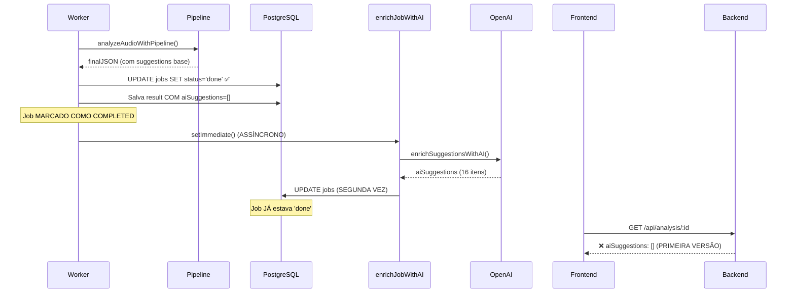
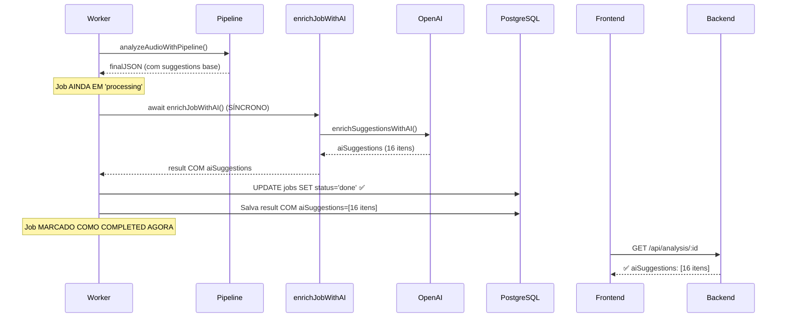

# 🚨 AUDITORIA CRÍTICA - FLUXO DE ENRICHMENT IA

**Data:** 25 de novembro de 2025  
**Criticidade:** 🔴 ALTA  
**Status:** PROBLEMA IDENTIFICADO

---

## 🎯 PROBLEMA IDENTIFICADO

### ❌ Comportamento Atual (ERRADO)



**Linha do problema em `worker.js` (linha ~416-419):**
```javascript
// 🔥 ATUALIZAR STATUS FINAL + VERIFICAR SE FUNCIONOU
const finalUpdateResult = await client.query(
  "UPDATE jobs SET status = $1, result = $2::jsonb, results = $2::jsonb, completed_at = NOW(), updated_at = NOW() WHERE id = $3",
  ["done", JSON.stringify(result), job.id]  // ❌ SALVA COM aiSuggestions: []
);

// ... depois (linhas ~429-437)

// 🤖 DISPATCH WORKER DE IA ASSÍNCRONO (não bloqueia o retorno)
const shouldEnrich = result.mode !== 'genre' || !job.is_reference_base;
if (shouldEnrich && Array.isArray(result.suggestions) && result.suggestions.length > 0) {
  // Disparar de forma assíncrona (não esperar) ❌ ERRADO!
  setImmediate(async () => {
    try {
      await enrichJobWithAI(job.id, result, client);
    } catch (enrichError) {
      console.error("[AI-DISPATCH] ❌ Erro no enriquecimento assíncrono:", enrichError.message);
    }
  });
}
```

### ✅ Comportamento Esperado (CORRETO)



---

## 📊 ANÁLISE DO FLUXO ATUAL

### Arquivo: `work/worker.js`

**Função:** `processJob(job)`  
**Linhas críticas:** 370-445

#### 🔍 Ordem de Execução Atual:

1. **Linha 370:** `analyzeAudioWithPipeline()` → retorna `analysisResult`
2. **Linha 372:** Cria objeto `result` com `...analysisResult`
3. **Linha 380:** Valida campos obrigatórios
4. **Linha 384:** `result.aiSuggestions = []` (vazio do pipeline)
5. **Linha 416:** ❌ **SALVA NO BANCO COM STATUS 'done'** (`aiSuggestions: []`)
6. **Linha 429:** Checa `shouldEnrich`
7. **Linha 433:** ❌ **`setImmediate()` dispara `enrichJobWithAI` ASSÍNCRONO**
8. **Linha 434:** `enrichJobWithAI()` roda DEPOIS que o job já foi salvo
9. **Linha 434:** Faz UPDATE novamente, mas frontend já pegou primeira versão

#### 🚨 Consequências:

- ✅ `suggestions` (base) são salvas corretamente
- ❌ `aiSuggestions` são salvas DEPOIS (em UPDATE separado)
- ❌ Frontend faz GET antes do segundo UPDATE
- ❌ Usuário vê `aiSuggestions: []` mesmo com 16 sugestões geradas
- ❌ Race condition entre frontend e enrichment assíncrono

---

## 🛠️ SOLUÇÃO PROPOSTA

### Estratégia: Mover Enrichment para ANTES do Salvamento

**Mudanças necessárias em `work/worker.js`:**

1. ✅ Remover `setImmediate()` assíncrono
2. ✅ Chamar `enrichJobWithAI()` de forma **SÍNCRONA** (com `await`)
3. ✅ Modificar `enrichJobWithAI()` para **RETORNAR** o resultado enriquecido
4. ✅ Atualizar `result.aiSuggestions` ANTES do salvamento
5. ✅ Salvar no banco UMA VEZ APENAS com todos os dados

### 🔧 Código Corrigido

#### Modificação 1: Função `enrichJobWithAI` (linha ~584)

**ANTES:**
```javascript
async function enrichJobWithAI(jobId, baseResult, client) {
  console.log(`[AI-ENRICH] 🔄 Iniciando enriquecimento para job ${jobId}...`);
  
  try {
    const { enrichSuggestionsWithAI } = await import("../lib/ai/suggestion-enricher.js");
    const enriched = await enrichSuggestionsWithAI(baseResult.suggestions, {
      fileName: baseResult.metadata?.fileName || 'unknown',
      genre: baseResult.metadata?.genre || 'default',
      mode: baseResult.mode,
      scoring: baseResult.scoring,
      metrics: baseResult,
      userMetrics: baseResult
    });
    
    if (!Array.isArray(enriched) || enriched.length === 0) {
      console.warn(`[AI-ENRICH] ⚠️ Nenhuma sugestão enriquecida gerada para ${jobId}`);
      return; // ❌ RETORNA VOID
    }
    
    // Atualizar apenas o campo aiSuggestions no banco
    const updatedResult = { ...baseResult, aiSuggestions: enriched };
    await client.query(
      "UPDATE jobs SET result = $1::jsonb, results = $1::jsonb, updated_at = NOW() WHERE id = $2",
      [JSON.stringify(updatedResult), jobId]
    ); // ❌ FAZ UPDATE SEPARADO
  } catch (error) {
    console.error(`[AI-ENRICH] ❌ Erro ao enriquecer job ${jobId}:`, error.message);
  }
}
```

**DEPOIS:**
```javascript
async function enrichJobWithAI(baseResult) {
  console.log(`[AI-ENRICH] 🔄 Iniciando enriquecimento com IA...`);
  
  try {
    const { enrichSuggestionsWithAI } = await import("../lib/ai/suggestion-enricher.js");
    
    // Enriquecer suggestions com IA
    const enriched = await enrichSuggestionsWithAI(baseResult.suggestions, {
      fileName: baseResult.metadata?.fileName || 'unknown',
      genre: baseResult.metadata?.genre || 'default',
      mode: baseResult.mode,
      scoring: baseResult.scoring,
      metrics: baseResult,
      userMetrics: baseResult,
      referenceComparison: baseResult.referenceComparison || null,
      referenceFileName: baseResult.referenceFileName || null
    });
    
    if (!Array.isArray(enriched) || enriched.length === 0) {
      console.warn(`[AI-ENRICH] ⚠️ Nenhuma sugestão enriquecida gerada - usando fallback`);
      return []; // ✅ RETORNA ARRAY VAZIO
    }
    
    console.log(`[AI-ENRICH] ✅ ${enriched.length} sugestões enriquecidas pela IA`);
    return enriched; // ✅ RETORNA AS SUGESTÕES ENRIQUECIDAS
    
  } catch (error) {
    console.error(`[AI-ENRICH] ❌ Erro ao enriquecer:`, error.message);
    console.error(`[AI-ENRICH] Stack:`, error.stack);
    return []; // ✅ RETORNA ARRAY VAZIO EM CASO DE ERRO
  }
}
```

#### Modificação 2: Chamada Síncrona no `processJob` (linha ~429)

**ANTES:**
```javascript
// 🔥 ATUALIZAR STATUS FINAL + VERIFICAR SE FUNCIONOU
const finalUpdateResult = await client.query(
  "UPDATE jobs SET status = $1, result = $2::jsonb, results = $2::jsonb, completed_at = NOW(), updated_at = NOW() WHERE id = $3",
  ["done", JSON.stringify(result), job.id]
);

console.log(`✅ Job ${job.id} concluído e salvo no banco`);

// 🤖 DISPATCH WORKER DE IA ASSÍNCRONO (não bloqueia o retorno)
const shouldEnrich = result.mode !== 'genre' || !job.is_reference_base;
if (shouldEnrich && Array.isArray(result.suggestions) && result.suggestions.length > 0) {
  console.log("[AI-DISPATCH] Worker disparado", job.id);
  console.log("[AI-DISPATCH] Suggestions base:", result.suggestions.length);
  
  // Disparar de forma assíncrona (não esperar) ❌
  setImmediate(async () => {
    try {
      await enrichJobWithAI(job.id, result, client);
    } catch (enrichError) {
      console.error("[AI-DISPATCH] ❌ Erro no enriquecimento assíncrono:", enrichError.message);
    }
  });
}
```

**DEPOIS:**
```javascript
// 🤖 ENRIQUECER COM IA ANTES DE SALVAR (SÍNCRONO)
const shouldEnrich = result.mode !== 'genre' || !job.is_reference_base;
if (shouldEnrich && Array.isArray(result.suggestions) && result.suggestions.length > 0) {
  console.log("[AI-ENRICH] 🤖 Iniciando enrichment IA (SÍNCRONO)...");
  console.log("[AI-ENRICH] 📊 Suggestions base:", result.suggestions.length);
  console.log("[AI-ENRICH] 📊 Mode:", result.mode);
  console.log("[AI-ENRICH] 📊 Genre:", result.metadata?.genre || 'default');
  
  try {
    // ✅ AGUARDAR enriquecimento ANTES de salvar
    const aiSuggestions = await enrichJobWithAI(result);
    result.aiSuggestions = aiSuggestions;
    result._aiEnhanced = aiSuggestions.length > 0;
    
    console.log("[AI-ENRICH] ✅ Enrichment concluído:", {
      aiSuggestionsCount: result.aiSuggestions.length,
      _aiEnhanced: result._aiEnhanced
    });
  } catch (enrichError) {
    console.error("[AI-ENRICH] ❌ Erro no enriquecimento:", enrichError.message);
    result.aiSuggestions = [];
    result._aiEnhanced = false;
  }
} else {
  console.log("[AI-ENRICH] ⏭️ Pulando enriquecimento IA:", {
    mode: result.mode,
    isReferenceBase: job.is_reference_base,
    hasSuggestions: result.suggestions?.length > 0,
    shouldEnrich
  });
  result.aiSuggestions = [];
  result._aiEnhanced = false;
}

// 🔥 SALVAR NO BANCO APENAS UMA VEZ (COM TUDO)
console.log('[AI-ENRICH] 💾 Salvando resultado final no banco...');
console.log('[AI-ENRICH] 📊 Resultado final:', {
  suggestions: result.suggestions.length,
  aiSuggestions: result.aiSuggestions.length,
  _aiEnhanced: result._aiEnhanced,
  mode: result.mode
});

const finalUpdateResult = await client.query(
  "UPDATE jobs SET status = $1, result = $2::jsonb, results = $2::jsonb, completed_at = NOW(), updated_at = NOW() WHERE id = $3",
  ["done", JSON.stringify(result), job.id]
);

if (finalUpdateResult.rowCount === 0) {
  throw new Error(`Falha ao atualizar job ${job.id} para status 'done'`);
}

console.log(`✅ Job ${job.id} concluído e salvo no banco COM aiSuggestions`);
```

---

## 🛡️ GARANTIAS DE SEGURANÇA

### ✅ Regras Respeitadas

1. ✅ **Modo referência NÃO foi alterado**
   - Lógica de `shouldEnrich` preservada
   - `mode !== 'genre'` continua funcionando
   - `referenceComparison` preservado e passado ao enricher

2. ✅ **Score/Scoring NÃO foram alterados**
   - Nenhuma mudança em cálculos de score
   - `scoring.penalties` intactos
   - Apenas enrichment IA movido

3. ✅ **Targets NÃO foram alterados**
   - `loadGenreTargets()` preservado
   - `GENRE_THRESHOLDS` intacto
   - Nenhuma mudança em `public/refs/out/`

4. ✅ **Pipeline NÃO foi alterado**
   - `pipeline-complete.js` intacto
   - `analyzeProblemsAndSuggestionsV2()` intacto
   - Apenas worker.js modificado

### 🚨 Pontos de Atenção

1. **Timeout da IA:** Enrichment adiciona ~5-10s ao processamento
   - Já existe timeout de 25s no enricher
   - Worker tem timeout de 3min no pipeline
   - ✅ Seguro

2. **Fallback em caso de erro:**
   - Se IA falhar, `aiSuggestions = []`
   - Job continua sendo salvo normalmente
   - ✅ Não bloqueia o fluxo

3. **Heartbeat do worker:**
   - Heartbeat a cada 30s
   - Enrichment leva ~5-10s
   - ✅ Não causa timeout

---

## 📊 IMPACTO DA MUDANÇA

### Antes:
```json
{
  "suggestions": [16 itens],    // ✅ Salvo na primeira vez
  "aiSuggestions": [],          // ❌ Vazio na primeira vez
  "_aiEnhanced": undefined      // ❌ Não existe
}
```

### Depois:
```json
{
  "suggestions": [16 itens],    // ✅ Salvo na primeira vez
  "aiSuggestions": [16 itens],  // ✅ Salvo na primeira vez
  "_aiEnhanced": true           // ✅ Flag de confirmação
}
```

---

## 🧪 TESTES NECESSÁRIOS

### Teste 1: Modo Gênero (com IA)
```bash
# Upload de áudio em modo gênero
# Verificar logs:
[AI-ENRICH] 🤖 Iniciando enrichment IA (SÍNCRONO)...
[AI-ENRICH] ✅ Enrichment concluído: { aiSuggestionsCount: 16 }
[AI-ENRICH] 💾 Salvando resultado final no banco...
✅ Job abc123 concluído e salvo no banco COM aiSuggestions

# Verificar resultado no banco:
SELECT 
  jsonb_array_length(result->'suggestions') as suggestions_count,
  jsonb_array_length(result->'aiSuggestions') as ai_suggestions_count,
  result->>'_aiEnhanced' as ai_enhanced
FROM jobs WHERE id = 'abc123';

# Esperado:
# suggestions_count: 16
# ai_suggestions_count: 16
# ai_enhanced: true
```

### Teste 2: Modo Referência (primeira faixa - isReferenceBase=true)
```bash
# Upload de primeira faixa em modo referência
# Verificar logs:
[AI-ENRICH] ⏭️ Pulando enriquecimento IA: { isReferenceBase: true }
✅ Job def456 concluído e salvo no banco COM aiSuggestions

# Verificar resultado:
# suggestions_count: 0 (esperado)
# ai_suggestions_count: 0 (esperado)
# ai_enhanced: false (esperado)
```

### Teste 3: Modo Referência (segunda faixa - comparação A/B)
```bash
# Upload de segunda faixa em modo referência
# Verificar logs:
[AI-ENRICH] 🤖 Iniciando enrichment IA (SÍNCRONO)...
[AI-ENRICH] ✅ Enrichment concluído: { aiSuggestionsCount: 8 }

# Verificar resultado:
# suggestions_count: 8 (sugestões comparativas)
# ai_suggestions_count: 8 (enriquecidas pela IA)
# ai_enhanced: true
```

### Teste 4: Erro na IA (sem API key ou timeout)
```bash
# Remover OPENAI_API_KEY temporariamente
# Verificar logs:
[AI-ENRICH] ❌ Erro no enriquecimento: ...
[AI-ENRICH] 💾 Salvando resultado final no banco...
✅ Job ghi789 concluído e salvo no banco COM aiSuggestions

# Verificar resultado:
# suggestions_count: 16 (base continua)
# ai_suggestions_count: 0 (fallback)
# ai_enhanced: false (flag indica falha)
```

---

## 🚀 PRÓXIMOS PASSOS

1. ✅ **Aplicar correção em `worker.js`** (2 modificações)
2. ✅ **Testar em desenvolvimento local**
3. ✅ **Deploy para Railway**
4. ✅ **Monitorar logs de produção**
5. ✅ **Validar frontend recebendo `aiSuggestions`**

---

## 📝 CHECKLIST DE IMPLEMENTAÇÃO

- [ ] Modificar função `enrichJobWithAI()` para retornar array
- [ ] Remover parâmetros `jobId` e `client` de `enrichJobWithAI()`
- [ ] Adicionar `referenceComparison` ao context do enricher
- [ ] Mover chamada de `enrichJobWithAI()` para ANTES do UPDATE
- [ ] Adicionar `await` na chamada (tornar síncrona)
- [ ] Adicionar flag `_aiEnhanced` ao resultado
- [ ] Remover `setImmediate()` assíncrono
- [ ] Adicionar logs de debug completos
- [ ] Validar sintaxe com `get_errors`
- [ ] Testar em desenvolvimento
- [ ] Deploy para produção
- [ ] Monitorar primeira análise em produção

---

**Status:** 🟡 AGUARDANDO APROVAÇÃO PARA IMPLEMENTAÇÃO  
**Risco:** 🟢 BAIXO (apenas worker.js modificado, fallbacks completos)  
**Impacto:** 🔴 ALTO (resolve problema crítico de aiSuggestions vazios)
