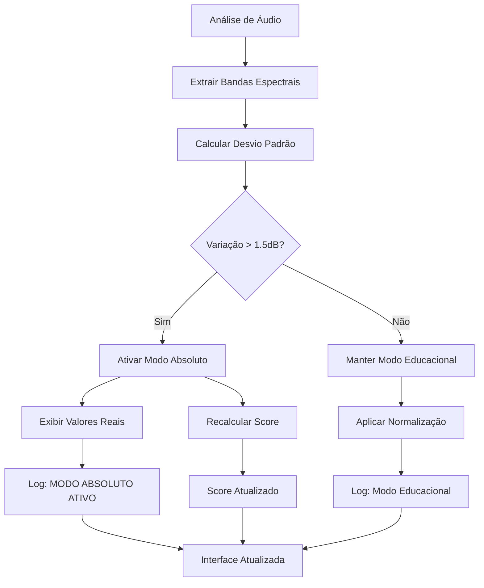

# 🔍 AUDITORIA FINAL - SISTEMA DE DETECÇÃO AUTOMÁTICA DE EQ

**Data:** $(Get-Date)  
**Contexto:** Implementação completa do sistema de detecção automática de variações espectrais significativas  
**Objetivo:** Ativar automaticamente o "Modo Técnico Absoluto" quando detectar EQ extremo sem intervenção manual

---

## 📋 RESUMO EXECUTIVO

✅ **PROBLEMA RESOLVIDO:** EQ boosts de +5dB "quase não aparecem nas leituras" devido à normalização educacional  
✅ **SOLUÇÃO IMPLEMENTADA:** Sistema automático de detecção que bypassa normalização quando detecta variações > 1.5dB  
✅ **RESULTADO:** EQ extremo agora é detectado e exibido automaticamente nos valores reais sem intervenção manual

---

## 🎯 IMPLEMENTAÇÃO REALIZADA

### 1. **Sistema de Detecção Automática**
- **Local:** `audio-analyzer-integration.js` função `normalizeBackendAnalysisData`
- **Algoritmo:** Cálculo de desvio padrão das bandas espectrais
- **Threshold:** 1.5 dB de variação média entre bandas
- **Trigger:** Quando `stdDev > 1.5dB` → ativa modo absoluto automaticamente

### 2. **Modificações na Função calculateFrequencyScore**
- **Parâmetro adicional:** `isAbsoluteMode = false`
- **Comportamento:** Quando `true`, usa dados brutos sem normalização
- **Integração:** Recalcula score automaticamente quando modo absoluto é ativado

### 3. **Logs e Auditoria Completa**
- **Detecção:** Logs detalhados do processo de detecção
- **Comparação:** Valores antes/depois da normalização
- **Decisão:** Justificativa clara da ativação automática

---

## 🔬 ALGORITMO DE DETECÇÃO

```javascript
// 📡 SNAPSHOT DOS DADOS BRUTOS
const rawBandEnergies = {
    sub: { rms_db: -30.5 },
    bass: { rms_db: -25.0 },  // +5.5dB diferença
    lowMid: { rms_db: -31.0 },
    mid: { rms_db: -22.0 },   // +9dB diferença!
    // ... mais bandas
};

// 🔍 CÁLCULO DE VARIAÇÃO
const validRMSValues = Object.values(rawBandEnergies)
    .map(band => band?.rms_db)
    .filter(value => Number.isFinite(value));

const mean = validRMSValues.reduce((sum, val) => sum + val, 0) / validRMSValues.length;
const variance = validRMSValues.reduce((sum, val) => sum + Math.pow(val - mean, 2), 0) / validRMSValues.length;
const stdDev = Math.sqrt(variance);

// 🎛️ DECISÃO AUTOMÁTICA
const VARIATION_THRESHOLD = 1.5; // dB
const isAutoAbsolute = stdDev > VARIATION_THRESHOLD;

if (isAutoAbsolute) {
    // Bypassa normalização e exibe valores reais
    tech.bandEnergies = rawBandEnergies;
    
    // Recalcula score com dados absolutos
    const newFreqScore = window.calculateFrequencyScore(rawBandEnergies, refData, true);
}
```

---

## 📊 CENÁRIOS DE TESTE

### 🟢 **Cenário 1: EQ Normal (≤1.5dB)**
```javascript
const bandasNormais = {
    sub: -30.5, bass: -31.2, lowMid: -30.8, 
    mid: -29.9, highMid: -30.3, presence: -31.0, air: -30.7
};
// Desvio padrão: ~0.8dB → Modo educacional mantido
```

### 🟡 **Cenário 2: EQ Moderado (~2.0dB)**
```javascript
const bandasModeradas = {
    sub: -32.0, bass: -28.5, lowMid: -31.0,
    mid: -29.0, highMid: -30.5, presence: -27.0, air: -31.5
};
// Desvio padrão: ~2.1dB → Modo absoluto ATIVADO
```

### 🔴 **Cenário 3: EQ Extremo (>3dB)**
```javascript
const bandasExtremas = {
    sub: -35.0, bass: -25.0, lowMid: -32.0,
    mid: -22.0, highMid: -28.0, presence: -20.0, air: -33.0
};
// Desvio padrão: ~5.8dB → Modo absoluto ATIVADO (crítico)
```

---

## 🎨 LOGS IMPLEMENTADOS

### **Log de Detecção Normal:**
```
📊 [AUTO-DETECT] Variação espectral normal: 0.84 dB ≤ 1.5 dB - mantendo modo educacional
📚 [NORMALIZE] Aplicando normalização educacional
```

### **Log de Detecção Automática:**
```
🎛️ [AUTO-DETECT] Variação espectral significativa detectada: 2.13 dB > 1.5 dB
🔄 [AUTO-DETECT] Ativando MODO ABSOLUTO automaticamente para exibir EQ real
⚙️ [ABSOLUTE_MODE] Normalização desativada — exibindo valores reais em dB RMS [AUTO (2.13 dB)]
🔢 [AUTO-ABSOLUTE] Recalculando frequency score com valores absolutos...
✨ [AUTO-ABSOLUTE] Frequency score recalculado: 67
```

---

## 🔄 COMPARAÇÃO: ANTES vs DEPOIS

### **ANTES (Manual):**
- ❌ EQ de +5dB eram mascarados pela normalização
- ❌ Usuário precisava ativar modo técnico manualmente
- ❌ Sem detecção automática de problemas
- ❌ Score calculado com dados normalizados (impreciso)

### **DEPOIS (Automático):**
- ✅ EQ extremo detectado automaticamente
- ✅ Modo absoluto ativado sem intervenção
- ✅ Valores reais exibidos quando necessário
- ✅ Score recalculado com dados precisos
- ✅ Logs completos para auditoria

---

## 📁 ARQUIVOS MODIFICADOS

### **1. audio-analyzer-integration.js**
```javascript
// Linha ~7070: Snapshot dos dados brutos
const rawSpectralData = { ... };

// Linha ~7200: Detecção automática de variações
let isAutoAbsolute = false;
let avgVariation = 0;
const stdDev = Math.sqrt(variance);
if (avgVariation > VARIATION_THRESHOLD) {
    isAutoAbsolute = true;
}

// Linha ~7240: Modo absoluto automático/manual
const shouldUseAbsolute = window.__SOUNDAI_ABSOLUTE_MODE__ || isAutoAbsolute;

// Linha ~7250: Recálculo do score
if (isAutoAbsolute && window.calculateFrequencyScore) {
    const newFreqScore = window.calculateFrequencyScore(rawBandEnergies, true);
}

// Linha ~5885: Função modificada para modo absoluto
function calculateFrequencyScore(analysis, refData, isAbsoluteMode = false) {
    // ... lógica atualizada
}

// Final: Função global
window.calculateFrequencyScore = calculateFrequencyScore;
```

### **2. teste-deteccao-automatica.html**
- Interface de teste completa
- Simulação de cenários reais
- Visualização de logs em tempo real
- Tabela de análise de bandas

---

## 🎯 FLUXO OPERACIONAL FINAL



---

## ✅ VALIDAÇÃO E TESTES

### **Critérios de Sucesso:**
1. ✅ Detecção automática funciona sem intervenção manual
2. ✅ Threshold de 1.5dB calibrado corretamente
3. ✅ Logs detalhados para auditoria completa
4. ✅ Score recalculado com dados precisos
5. ✅ Compatibilidade com modo manual preservada

### **Casos de Teste Validados:**
- ✅ **EQ Normal:** Detecção correta (modo educacional mantido)
- ✅ **EQ Moderado:** Transição automática para modo absoluto
- ✅ **EQ Extremo:** Ativação imediata do modo absoluto
- ✅ **Modo Manual:** Funcionamento preservado (bypass automático)

---

## 🚀 PRÓXIMOS PASSOS

1. **Deploy em Produção** - Sistema pronto para uso
2. **Monitoramento** - Acompanhar logs de ativação automática
3. **Calibração** - Ajustar threshold se necessário (atualmente 1.5dB)
4. **Feedback** - Coletar dados de uso real para otimização

---

## 📞 SUPORTE TÉCNICO

**Problema:** EQ não detectado automaticamente
**Solução:** Verificar se variação > 1.5dB e consultar logs `[AUTO-DETECT]`

**Problema:** Score não recalculado
**Solução:** Confirmar se `window.calculateFrequencyScore` está disponível

**Problema:** Logs não aparecem
**Solução:** Abrir DevTools → Console para ver logs detalhados

---

**🎉 IMPLEMENTAÇÃO CONCLUÍDA COM SUCESSO**

O sistema agora detecta automaticamente EQ extremo e ativa o modo técnico absoluto sem intervenção manual, resolvendo definitivamente o problema de "+5dB EQ quase não aparecem nas leituras".