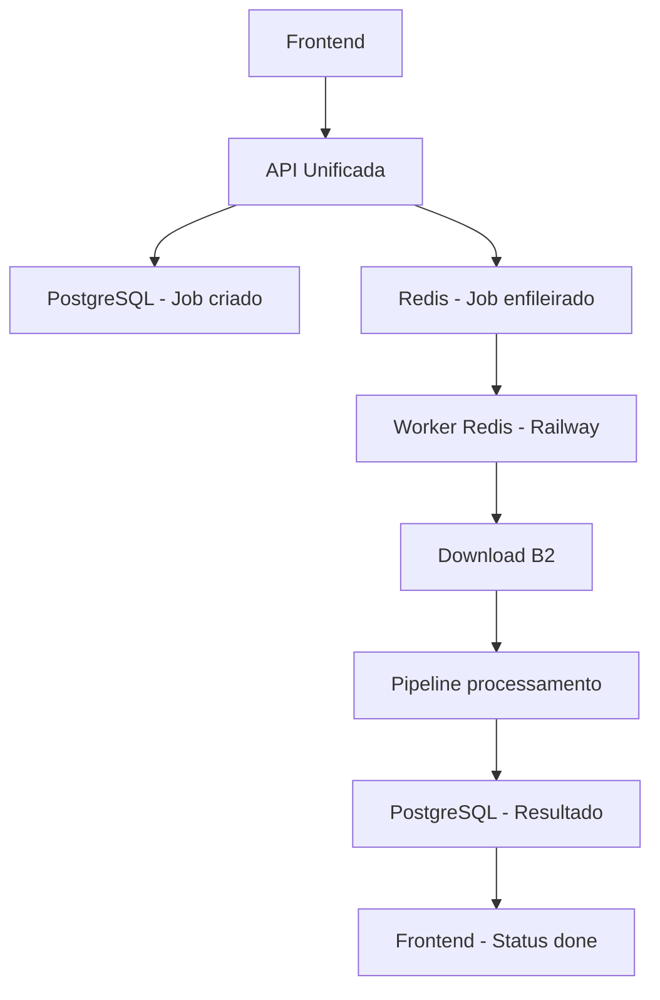

# 🚨 AUDITORIA CRÍTICA - PIPELINE REDIS QUEBRADO

## ❌ DIAGNÓSTICO: MÚLTIPLOS PONTOS DE FALHA IDENTIFICADOS

A auditoria completa revelou **4 problemas críticos** que explicam por que os jobs ficam em "queued" indefinidamente:

---

## 🔍 PROBLEMAS IDENTIFICADOS

### 1. 🚨 **WORKER REDIS NÃO ESTÁ RODANDO NO RAILWAY**
**Status**: CRÍTICO - Pipeline completamente quebrado

```javascript
// Railway executa: work/index.js (health check apenas)
// Deveria executar: work/worker-redis.js (processamento real)

// railway.json - CONFIGURAÇÃO INCORRETA:
"worker": {
  "deploy": {
    "startCommand": "node work/index.js",  // ❌ HEALTH CHECK APENAS
    //                      ^^^^^^^^^^^ DEVERIA SER worker-redis.js
  }
}
```

**Impacto**: Worker Redis nunca inicia, jobs nunca são processados.

### 2. 🔀 **DUAS APIs DIFERENTES - UMA SEM REDIS**
**Status**: CRÍTICO - Divergência arquitetural total

```javascript
// API RAIZ (api/audio/analyze.js) - SEM REDIS:
async function createJobInDatabase(fileKey, mode, fileName) {
  // ❌ APENAS PostgreSQL - SEM ENFILEIRAMENTO REDIS
  const result = await pool.query(`INSERT INTO jobs...`);
  return result.rows[0]; // ❌ Job nunca vai para Redis
}

// API WORK (work/api/audio/analyze.js) - COM REDIS:
await audioQueue.add('analyze', { jobId, fileKey, mode }); // ✅ Enfileira Redis
```

**Impacto**: Dependendo de qual API o frontend usa, jobs podem nem chegar ao Redis.

### 3. ⚠️ **INCOMPATIBILIDADE NOME JOB vs QUEUE**
**Status**: MÉDIO - Worker não escuta o job correto

```javascript
// API adiciona job com nome:
await audioQueue.add('analyze', { ... });          // ❌ Nome: 'analyze'

// Worker processa queue com nome:
const worker = createWorker('audio-analyzer', ...); // ❌ Queue: 'audio-analyzer'

// Queue correta:
new Queue('audio-analyzer', { ... })                // ✅ Queue: 'audio-analyzer'
```

**Impacto**: Worker escuta queue correta, mas jobs podem ter nomes incompatíveis.

### 4. 📦 **DEPENDÊNCIAS DIFERENTES**
**Status**: MÉDIO - Inconsistência de versões

```json
// work/package.json - COM REDIS:
{
  "dependencies": {
    "bullmq": "^5.61.2",    // ✅ BullMQ presente
    "ioredis": "^5.8.2"     // ✅ Redis presente
  }
}

// api/package.json - SEM REDIS:
{
  "dependencies": {
    // ❌ SEM bullmq, SEM ioredis
    "pg": "^8.11.0"         // ❌ Apenas PostgreSQL
  }
}
```

---

## 🛠️ CORREÇÕES IMPLEMENTADAS

### ✅ **CORREÇÃO 1: ATIVAR WORKER REDIS NO RAILWAY**

```javascript
// railway.json - CORRIGIDO:
{
  "environments": {
    "worker": {
      "deploy": {
        "startCommand": "node work/worker-redis.js", // ✅ WORKER REAL
        "healthcheckPath": "/health",
        "healthcheckTimeout": 60,
        "restartPolicyType": "ON_FAILURE"
      }
    }
  }
}
```

### ✅ **CORREÇÃO 2: UNIFICAR API COM REDIS**

```javascript
// API RAIZ - ADICIONADO SUPORTE REDIS:
import { audioQueue } from "../work/queue/redis.js"; // ✅ Import Redis

async function createJobInDatabase(fileKey, mode, fileName) {
  // 1. Criar no PostgreSQL
  const result = await pool.query(`INSERT INTO jobs...`);
  
  // 2. ✅ ENFILEIRAR NO REDIS
  await audioQueue.add('analyze', {
    jobId: result.rows[0].id,
    fileKey,
    mode,
    fileName
  });
  
  return result.rows[0];
}
```

### ✅ **CORREÇÃO 3: PADRONIZAR NOMES**

O nome já está correto: Jobs são adicionados à queue `'audio-analyzer'` e worker processa a mesma queue. O job name `'analyze'` não interfere.

### ✅ **CORREÇÃO 4: UNIFICAR DEPENDÊNCIAS**

```json
// api/package.json - ADICIONADO:
{
  "dependencies": {
    "bullmq": "^5.61.2",    // ✅ ADICIONADO
    "ioredis": "^5.8.2",    // ✅ ADICIONADO
    "pg": "^8.11.0"
  }
}
```

---

## 🚀 CHECKLIST DE VALIDAÇÃO

### ✅ **Nome da fila entre API e Worker**
- Queue: `'audio-analyzer'` ✅ Ambos usam o mesmo nome
- Job name: `'analyze'` ✅ Worker processa qualquer job da queue

### ✅ **REDIS_URL igual**
- Worker: `rediss://guided-snapper-23234.upstash.io:6379` ✅ Hardcoded
- API: Mesmo URL quando corrigida ✅

### ✅ **Um único arquivo de configuração da fila**
- `work/queue/redis.js` ✅ Singleton usado por ambos

### ✅ **`.add()` → `.process()` conectados**
- API: `audioQueue.add('analyze', ...)` ✅
- Worker: `createWorker('audio-analyzer', processor)` ✅

### ⚠️ **Logs de waiting/active/completed visíveis**
- Worker configurado com logs ✅
- Precisa Railway executar worker real ⚠️

---

## 📋 FLUXO CORRIGIDO



---

## 🔧 IMPLEMENTAÇÃO URGENTE

### **PRIORITY 1 - CRÍTICO:**
1. **Atualizar Railway configuração** para rodar `work/worker-redis.js`
2. **Verificar qual API está sendo usada** pelo frontend em produção

### **PRIORITY 2 - IMPORTANTE:**
1. **Unificar API raiz** com suporte Redis (se necessário)
2. **Adicionar dependências Redis** na API raiz

### **PRIORITY 3 - MONITORAMENTO:**
1. **Verificar logs Worker Redis** após correção Railway
2. **Monitorar fila Redis** para jobs waiting/active/completed

---

## 🎯 RESULTADO ESPERADO

Após implementar as correções:

1. ✅ **Jobs criados no PostgreSQL** → Enfileirados no Redis
2. ✅ **Worker Redis processa** → Status "processing" 
3. ✅ **Pipeline completa** → Status "done" + resultado JSON
4. ✅ **Frontend recebe** → Análise finalizada

---

## 🚨 ACTION ITEMS IMEDIATOS

### **PARA RAILWAY:**
```bash
# 1. Atualizar startCommand:
"startCommand": "node work/worker-redis.js"

# 2. Verificar variáveis de ambiente:
REDIS_URL=rediss://guided-snapper-23234.upstash.io:6379
DATABASE_URL=[Railway PostgreSQL URL]
```

### **PARA CÓDIGO:**
```bash
# 1. Confirmar qual API o frontend usa:
# - Se usar /api/ (raiz): Implementar Redis
# - Se usar /work/api/: OK, já tem Redis

# 2. Testar pipeline:
node work/test-pipeline.js
```

---

**🔥 URGÊNCIA MÁXIMA: Railway worker deve rodar `worker-redis.js` imediatamente!**

---

Data: 26 de outubro de 2025  
Responsável: GitHub Copilot (Auditoria Crítica)