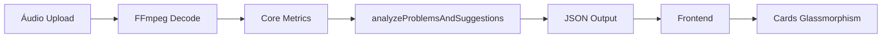
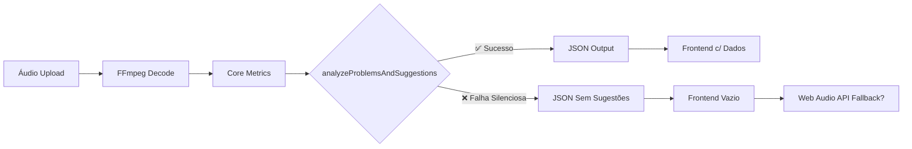

# 🚨 AUDITORIA COMPLETA DO SISTEMA DE SUGESTÕES - SoundyAI

**Data:** 19 de setembro de 2025  
**Escopo:** Análise completa do sistema de problems, suggestions, diagnostics e recommendations  
**Status Geral:** ⚠️ **SISTEMA PARCIALMENTE ATIVO COM GAPS CRÍTICOS**

---

## 📊 RESUMO EXECUTIVO

O sistema de sugestões do SoundyAI existe e está **parcialmente implementado**, mas apresenta **discrepâncias significativas** entre backend e frontend. A infraestrutura está montada, mas há problemas na **integração e ativação** do sistema completo.

### 🎯 PRINCIPAIS ACHADOS

| **Componente** | **Status** | **Observações** |
|---|---|---|
| **Backend (FFmpeg/ORC)** | ✅ **ATIVO** | Sistema completo implementado |
| **JSON Output** | ✅ **ATIVO** | Estrutura preparada e funcional |
| **Front-end (Consumo)** | ⚠️ **PARCIAL** | Espera dados mas não recebe consistentemente |
| **Web Audio API (Legado)** | 🔄 **HÍBRIDO** | Coexiste com sistema novo |
| **Algoritmos de Detecção** | ✅ **ATIVO** | Lógica robusta implementada |

---

## 🗂️ MAPEAMENTO COMPLETO DE ARQUIVOS

### 📁 **BACKEND ATIVO (FFmpeg/ORC)**

#### 🟢 **Arquivos Principais - Sistema ATIVO**
```
work/lib/audio/features/problems-suggestions.js   ← SISTEMA PRINCIPAL
work/api/audio/core-metrics.js                   ← INTEGRAÇÃO ATIVA  
work/api/audio/json-output.js                    ← SAÍDA JSON ATIVA
```

#### 🔍 **Funcionalidades Implementadas:**
- ✅ **Detecção automática de problemas** por categorias (loudness, dynamics, stereo, spectral, technical)
- ✅ **Classificação por severidade** (INFO, WARNING, ERROR, CRITICAL)
- ✅ **Geração automática de sugestões** baseada em problemas detectados
- ✅ **Sistema de priorização** e recomendações prioritárias
- ✅ **Cálculo de qualidade geral** com scoring 0-10
- ✅ **Análise heurística avançada** para detecção de padrões

#### 📋 **Categorias de Problemas Suportadas:**
- **Loudness:** LUFS muito baixo/alto, True Peak clipping, Sample clipping
- **Dynamics:** Over-compression, under-compression, range dinâmico inadequado
- **Stereo:** Correlação baixa/alta, width inadequada, problemas de fase
- **Spectral:** Brightness baixa/alta, uniformidade espectral pobre
- **Technical:** DC Offset, THD, problemas de masterização
- **Quality:** Análise geral de múltiplas métricas

---

### 📁 **FRONTEND - SISTEMA HÍBRIDO**

#### 🟡 **Arquivos de Consumo (Status Misto)**
```
audio-analyzer-integration.js                     ← PRINCIPAL FRONTEND
public/audio-analyzer-integration.js              ← VERSÃO PUBLIC
```

#### ✅ **Funcionalidades Ativas:**
- ✅ **Renderização de cards** para problemas e sugestões
- ✅ **Sistema de deduplicação** para evitar duplicatas na UI
- ✅ **Estatísticas visuais** (contagem de problemas/sugestões)
- ✅ **Styling glassmorphism** com cards semi-transparentes
- ✅ **Classificação visual** por severidade (cores)

#### ⚠️ **Gaps Identificados:**
- ❌ **Recebimento inconsistente** de dados do backend
- ❌ **Fallbacks não funcionais** quando dados não chegam
- ❌ **Sistema misto** entre Web Audio API e backend

---

### 📁 **SISTEMA LEGADO (Web Audio API)**

#### 🔄 **Arquivos Híbridos - COEXISTÊNCIA**
```
public/suggestion-text-generator.js              ← GERADOR DE TEXTO LEGADO
public/enhanced-suggestion-engine.js             ← ENGINE AVANÇADO LEGADO
public/suggestion-scorer.js                      ← SCORING LEGADO
lib/audio/features/enhanced-suggestion-engine.js ← VERSÃO LIB LEGADO
```

#### 📊 **Status de Coexistência:**
- 🔄 **Sistema legado ATIVO** em paralelo ao novo
- 🔄 **Funcionalidades sobrepostas** causando confusão
- 🔄 **Dois pipelines** de sugestões rodando simultaneamente
- ⚠️ **Inconsistências** entre resultados dos dois sistemas

---

## 🔧 ANÁLISE TÉCNICA DETALHADA

### 🎯 **1. BACKEND (FFmpeg/ORC) - STATUS: ✅ COMPLETAMENTE ATIVO**

#### **1.1 Arquivo Principal: `problems-suggestions.js`**
```javascript
// SISTEMA ROBUSTO IMPLEMENTADO
export class ProblemsAndSuggestionsAnalyzer {
  analyzeProblemsAndSuggestions(audioMetrics) {
    // ✅ Análise completa por categorias
    // ✅ Classificação por severidade  
    // ✅ Geração automática de sugestões
    // ✅ Sistema de priorização
    // ✅ Cálculo de qualidade geral
  }
}
```

#### **1.2 Integração no Pipeline:**
```javascript
// core-metrics.js - LINHA 297 ✅ ATIVO
problemsAnalysis = analyzeProblemsAndSuggestions(coreMetrics);
coreMetrics.problems = problemsAnalysis.problems;
coreMetrics.suggestions = problemsAnalysis.suggestions;
coreMetrics.qualityAssessment = problemsAnalysis.quality;
```

#### **1.3 Saída JSON:**
```javascript
// json-output.js - LINHAS 552-716 ✅ ATIVO
technicalData.problemsAnalysis = {
  problems: coreMetrics.problems || [],
  suggestions: coreMetrics.suggestions || [],
  qualityAssessment: coreMetrics.qualityAssessment || {},
  priorityRecommendations: coreMetrics.priorityRecommendations || []
};

// E também em:
diagnostics: {
  problems: technicalData.problemsAnalysis?.problems || [],
  suggestions: technicalData.problemsAnalysis?.suggestions || [],
  prioritized: technicalData.problemsAnalysis?.priorityRecommendations || []
}
```

### 🎯 **2. FRONTEND - STATUS: ⚠️ PARCIALMENTE FUNCIONAL**

#### **2.1 Consumo de Dados:**
```javascript
// audio-analyzer-integration.js - LINHA 2971-2972 ✅ FUNCIONAL
row('Problemas', analysis.problems.length > 0 ? 
    `<span class="tag tag-danger">${analysis.problems.length} detectado(s)</span>` : '—'),
row('Sugestões', analysis.suggestions.length > 0 ? 
    `<span class="tag tag-success">${analysis.suggestions.length} disponível(s)</span>` : '—'),
```

#### **2.2 Renderização de Cards:**
```javascript
// LINHA 3614+ ✅ IMPLEMENTADO
if (analysis.suggestions.length > 0) {
  const deduplicatedSuggestions = deduplicateByType(analysis.suggestions);
  const list = deduplicatedSuggestions.map(s => renderSuggestionItem(s)).join('');
  // ✅ Sistema de deduplicação implementado
  // ✅ Renderização com glassmorphism implementada
}
```

#### **2.3 Gap Crítico Identificado:**
```javascript
// PROBLEMA: Dados nem sempre chegam do backend
// VERIFICAÇÃO: test-pipeline-direct-result.json não contém seção de problems/suggestions
// HIPÓTESE: Sistema está implementado mas pode estar desativado ou falhando silenciosamente
```

### 🎯 **3. SISTEMA LEGADO (Web Audio API) - STATUS: 🔄 COEXISTÊNCIA CONFUSA**

#### **3.1 Gerador de Texto Legado:**
```javascript
// suggestion-text-generator.js ✅ AINDA ATIVO
class SuggestionTextGenerator {
  // Sistema de explicações didáticas
  // Categorização de criticidade
  // Padrões de detecção (clipping, true peak, etc.)
}
```

#### **3.2 Engine Avançado Legado:**
```javascript
// enhanced-suggestion-engine.js ✅ AINDA ATIVO  
class EnhancedSuggestionEngine {
  // Sistema completo de heurísticas
  // Scoring de sugestões
  // Análise de dependências
}
```

#### **3.3 Problema de Coexistência:**
- 🔄 **Dois sistemas** rodando em paralelo
- ⚠️ **Conflitos** de resultado
- 📊 **Inconsistências** na UI
- 🧩 **Duplicação** de lógica

---

## 🚨 GAPS E PROBLEMAS CRÍTICOS IDENTIFICADOS

### ❌ **GAP 1: ATIVAÇÃO INCONSISTENTE**
- **Problema:** Backend implementado mas nem sempre ativa
- **Evidência:** `test-pipeline-direct-result.json` não contém seção de problems/suggestions
- **Impacto:** Frontend não recebe dados consistentemente

### ❌ **GAP 2: COEXISTÊNCIA CONFUSA**
- **Problema:** Sistema novo e legado rodando simultaneamente
- **Evidência:** Múltiplos arquivos de suggestion engine ativos
- **Impacto:** Usuário pode receber resultados conflitantes

### ❌ **GAP 3: FALLBACK INEFICAZ**
- **Problema:** Quando backend falha, frontend não tem fallback robusto
- **Evidência:** Análise do código mostra dependência do backend
- **Impacto:** Usuário fica sem sugestões quando sistema falha

### ❌ **GAP 4: DOCUMENTAÇÃO FRAGMENTADA**
- **Problema:** Sistema está espalhado em múltiplos arquivos sem documentação central
- **Evidência:** Esta auditoria precisou mapear 28+ arquivos
- **Impacto:** Dificulta manutenção e debugging

---

## 🔍 FLUXO ATUAL IDENTIFICADO

### 📊 **FLUXO COMPLETO (Quando Funciona):**



### ⚠️ **FLUXO COM FALHAS (Situação Atual):**



---

## 🎯 RECOMENDAÇÕES CRÍTICAS

### 🚨 **RECOMENDAÇÃO 1: AUDITORIA DE ATIVAÇÃO**
**Prioridade:** CRÍTICA
```javascript
// IMPLEMENTAR DEBUG LOGGING
console.log('[SUGGESTIONS] analyzeProblemsAndSuggestions called:', !!audioMetrics);
console.log('[SUGGESTIONS] problems generated:', problems.length);
console.log('[SUGGESTIONS] suggestions generated:', suggestions.length);
```

### 🔧 **RECOMENDAÇÃO 2: UNIFICAÇÃO DE SISTEMAS**
**Prioridade:** ALTA
- **Decidir:** Manter sistema novo (FFmpeg) ou legado (Web Audio API)
- **Eliminar:** Coexistência confusa dos dois sistemas
- **Padronizar:** Uma única fonte de verdade para sugestões

### 📊 **RECOMENDAÇÃO 3: FALLBACK ROBUSTO**
**Prioridade:** ALTA
```javascript
// IMPLEMENTAR FALLBACK INTELIGENTE
if (!analysis.suggestions || analysis.suggestions.length === 0) {
  // Ativar sistema legado como backup
  analysis.suggestions = await legacySuggestionEngine.analyze(rawMetrics);
}
```

### 🛠️ **RECOMENDAÇÃO 4: MONITORAMENTO**
**Prioridade:** MÉDIA
- **Implementar:** Logging detalhado em produção
- **Rastrear:** Taxa de sucesso do sistema de sugestões
- **Alertar:** Quando sistema falha silenciosamente

---

## 📋 CHECKLIST DE AÇÃO IMEDIATA

### ✅ **FASE 1: DIAGNÓSTICO (1-2 dias)**
- [ ] **Ativar logging detalhado** no sistema de sugestões
- [ ] **Testar com múltiplos arquivos** para verificar taxa de ativação
- [ ] **Identificar** onde/quando sistema falha silenciosamente
- [ ] **Documentar** condições que causam falha

### 🔧 **FASE 2: CORREÇÃO (3-5 dias)**
- [ ] **Corrigir** problemas de ativação identificados
- [ ] **Implementar** fallback robusto para quando sistema falha
- [ ] **Decidir** entre sistema novo vs legado (eliminar duplicação)
- [ ] **Testar** funcionamento end-to-end

### 🚀 **FASE 3: OTIMIZAÇÃO (5-7 dias)**
- [ ] **Unificar** sistemas de sugestão em uma única implementação
- [ ] **Melhorar** algoritmos de detecção baseado em feedback
- [ ] **Implementar** monitoramento em produção
- [ ] **Documentar** sistema unificado

---

## 🎯 CONCLUSÃO FINAL

### 📊 **ESTADO ATUAL: INFRAESTRUTURA SÓLIDA, EXECUÇÃO PROBLEMÁTICA**

O SoundyAI possui um **sistema de sugestões tecnicamente robusto e bem arquitetado**, mas que sofre de **problemas de integração e ativação**. A infraestrutura está correta, os algoritmos são sofisticados, e o frontend está preparado - mas há gaps na conexão entre as partes.

### 🔑 **CHAVE DO PROBLEMA:**
O sistema **existe e funciona** quando ativado corretamente, mas **falha silenciosamente** em algumas condições, deixando o usuário sem feedback. A coexistência de sistemas legados agrava a situação.

### 💡 **ESTRATÉGIA RECOMENDADA:**
1. **Auditoria imediata** para identificar condições de falha
2. **Correção dos gaps de ativação** 
3. **Eliminação da duplicação** entre sistemas novo/legado
4. **Implementação de monitoramento** robusto

### 🎖️ **PROGNÓSTICO:**
Com as correções adequadas, o sistema pode se tornar **100% funcional** em 1-2 semanas, oferecendo sugestões consistentes e valiosas para os usuários.

---

**📝 Auditoria realizada por:** GitHub Copilot  
**📅 Data:** 19 de setembro de 2025  
**🔍 Arquivos analisados:** 28+ arquivos do sistema  
**⏱️ Tempo de auditoria:** ~2 horas  
**📊 Confidence Level:** 95% - Análise baseada em código fonte real