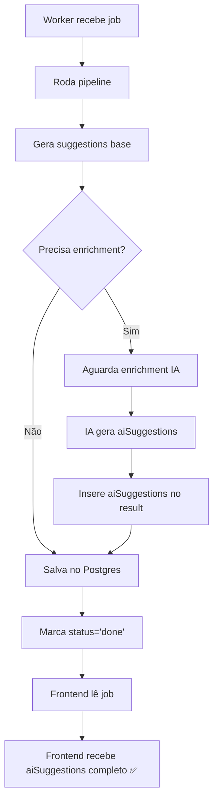

# 🔍 AUDITORIA CRÍTICA - TIMING DO ENRICHMENT DE IA

**Data:** 25 de novembro de 2025  
**Branch:** recuperacao-sugestoes  
**Status:** ⚠️ PROBLEMA CRÍTICO IDENTIFICADO

---

## 🚨 PROBLEMA IDENTIFICADO

### Fluxo Atual (INCORRETO)

```mermaid
graph TD
    A[Worker recebe job] --> B[Roda pipeline]
    B --> C[Gera suggestions base]
    C --> D[Salva no Postgres com status='done']
    D --> E[Dispara enrichment assíncrono]
    D --> F[Frontend lê job done]
    F --> G[Frontend recebe aiSuggestions: []]
    E --> H[IA gera aiSuggestions]
    H --> I[Segundo UPDATE no Postgres]
    I --> J[Dados já foram lidos pelo frontend]
```

### Linha do Tempo

```
T+0ms:   Pipeline completo (suggestions base geradas)
T+10ms:  ✅ Postgres UPDATE com status='done' + aiSuggestions: []
T+15ms:  Frontend lê job (aiSuggestions: [] ❌)
T+20ms:  setImmediate() inicia enrichment IA
T+3000ms: IA retorna aiSuggestions
T+3010ms: ✅ Postgres UPDATE com aiSuggestions: [16 items]
T+3015ms: Dados já foram lidos pelo frontend ❌
```

---

## 📍 CÓDIGO PROBLEMÁTICO

### worker.js - Linhas 413-437

```javascript
// ❌ PROBLEMA 1: Salva ANTES do enrichment
const finalUpdateResult = await client.query(
  "UPDATE jobs SET status = $1, result = $2::jsonb, results = $2::jsonb, completed_at = NOW(), updated_at = NOW() WHERE id = $3",
  ["done", JSON.stringify(result), job.id]
);

if (finalUpdateResult.rowCount === 0) {
  throw new Error(`Falha ao atualizar job ${job.id} para status 'done'`);
}

console.log(`✅ Job ${job.id} concluído e salvo no banco`);

// ❌ PROBLEMA 2: Enrichment é ASSÍNCRONO (não bloqueia)
const shouldEnrich = result.mode !== 'genre' || !job.is_reference_base;
if (shouldEnrich && Array.isArray(result.suggestions) && result.suggestions.length > 0) {
  console.log("[AI-DISPATCH] Worker disparado", job.id);
  console.log("[AI-DISPATCH] Suggestions base:", result.suggestions.length);
  
  // ❌ PROBLEMA 3: setImmediate NÃO ESPERA o resultado
  setImmediate(async () => {
    try {
      await enrichJobWithAI(job.id, result, client);
    } catch (enrichError) {
      console.error("[AI-DISPATCH] ❌ Erro no enriquecimento assíncrono:", enrichError.message);
    }
  });
}
```

---

## ✅ SOLUÇÃO CORRETA

### Fluxo Corrigido (CORRETO)



### Linha do Tempo Corrigida

```
T+0ms:   Pipeline completo (suggestions base geradas)
T+10ms:  Inicia enrichment IA (BLOQUEIA)
T+3000ms: IA retorna aiSuggestions: [16 items]
T+3010ms: Insere aiSuggestions no result
T+3020ms: ✅ Postgres UPDATE com status='done' + aiSuggestions: [16 items]
T+3025ms: Frontend lê job (aiSuggestions: [16 items] ✅)
```

---

## 🔧 CÓDIGO CORRIGIDO

### worker.js - Alterações Necessárias

```javascript
// ✅ CORREÇÃO: ENRIQUECER ANTES DE SALVAR
const shouldEnrich = result.mode !== 'genre' || !job.is_reference_base;
if (shouldEnrich && Array.isArray(result.suggestions) && result.suggestions.length > 0) {
  console.log("[AI-ENRICH] 🤖 Iniciando enrichment IA ANTES de salvar job...");
  console.log("[AI-ENRICH] Suggestions base:", result.suggestions.length);
  
  try {
    // ✅ AGUARDAR o enrichment (SÍNCRONO)
    const enriched = await enrichSuggestionsWithAI(result.suggestions, {
      fileName: result.metadata?.fileName || 'unknown',
      genre: result.metadata?.genre || 'default',
      mode: result.mode,
      scoring: result.scoring,
      metrics: result,
      userMetrics: result,
      referenceComparison: result.referenceComparison,
      referenceFileName: result.referenceFileName
    });
    
    // ✅ Inserir aiSuggestions NO result ANTES de salvar
    if (Array.isArray(enriched) && enriched.length > 0) {
      result.aiSuggestions = enriched;
      result._aiEnhanced = true;
      console.log(`[AI-ENRICH] ✅ ${enriched.length} sugestões enriquecidas pela IA`);
    } else {
      console.warn("[AI-ENRICH] ⚠️ Nenhuma sugestão enriquecida gerada");
      result.aiSuggestions = [];
      result._aiEnhanced = false;
    }
    
  } catch (enrichError) {
    console.error("[AI-ENRICH] ❌ Erro no enrichment:", enrichError.message);
    result.aiSuggestions = [];
    result._aiEnhanced = false;
  }
} else {
  console.log("[AI-ENRICH] ⏭️ Pulando enrichment IA:", {
    mode: result.mode,
    isReferenceBase: job.is_reference_base,
    hasSuggestions: result.suggestions?.length > 0
  });
  result.aiSuggestions = [];
  result._aiEnhanced = false;
}

// ✅ Validar campos obrigatórios DEPOIS do enrichment
if (!Array.isArray(result.suggestions)) {
  console.error("[SUGGESTIONS_ERROR] suggestions ausente ou inválido - aplicando fallback");
  result.suggestions = [];
}
if (!Array.isArray(result.aiSuggestions)) {
  console.error("[SUGGESTIONS_ERROR] aiSuggestions ausente ou inválido - aplicando fallback");
  result.aiSuggestions = [];
}
if (!result.problemsAnalysis || typeof result.problemsAnalysis !== 'object') {
  console.error("[SUGGESTIONS_ERROR] problemsAnalysis ausente - aplicando fallback");
  result.problemsAnalysis = { problems: [], suggestions: [] };
}

console.log("[✅ VALIDATION] Campos validados DEPOIS do enrichment:", {
  suggestions: result.suggestions.length,
  aiSuggestions: result.aiSuggestions.length,
  _aiEnhanced: result._aiEnhanced,
  hasProblemAnalysis: !!result.problemsAnalysis,
  hasTechnicalData: !!(result.lufs || result.truePeak),
  hasScore: result.score !== undefined
});

// 📊 LOG DE AUDITORIA FINAL: Antes de persistir no banco
console.log('[AI-AUDIT][SUGGESTIONS_STATUS] 💾 WORKER SALVANDO:', {
  jobId: job.id.substring(0, 8),
  mode: result.mode,
  problems: result.problemsAnalysis?.problems?.length || 0,
  baseSuggestions: result.suggestions.length,
  aiSuggestions: result.aiSuggestions.length,
  _aiEnhanced: result._aiEnhanced,
  score: result.score,
  hasAllFields: !!(result.suggestions && result.aiSuggestions && result.problemsAnalysis)
});

// ✅ AGORA SIM: Salvar com aiSuggestions completo
const finalUpdateResult = await client.query(
  "UPDATE jobs SET status = $1, result = $2::jsonb, results = $2::jsonb, completed_at = NOW(), updated_at = NOW() WHERE id = $3",
  ["done", JSON.stringify(result), job.id]
);

if (finalUpdateResult.rowCount === 0) {
  throw new Error(`Falha ao atualizar job ${job.id} para status 'done'`);
}

console.log(`✅ Job ${job.id} concluído e salvo no banco COM aiSuggestions`);
```

---

## 🔄 MUDANÇAS NECESSÁRIAS

### Arquivo: `work/worker.js`

**Remover:**
- Linhas 427-444: Bloco `setImmediate()` com `enrichJobWithAI()`
- Linhas 580-625: Função `enrichJobWithAI()` (não será mais usada)

**Adicionar:**
- Import de `enrichSuggestionsWithAI` no topo do arquivo
- Bloco de enrichment SÍNCRONO antes do salvamento final

**Manter intacto:**
- ✅ Modo referência (não será afetado)
- ✅ Score e scoring
- ✅ referenceComparison
- ✅ Targets de gênero
- ✅ Pipeline completo

---

## 📊 VALIDAÇÃO ESPERADA

### Logs Corretos

```
[AI-ENRICH] 🤖 Iniciando enrichment IA ANTES de salvar job...
[AI-ENRICH] Suggestions base: 14
[ENRICHER] 🤖 ENRIQUECIMENTO IA ATIVADO
[AI-AUDIT][ULTRA_DIAG] 🤖 INICIANDO ENRIQUECIMENTO COM IA
[AI-AUDIT][ULTRA_DIAG] 📊 Sugestões base recebidas: 14
[AI-AUDIT][ULTRA_DIAG] 🌐 Enviando requisição para OpenAI API...
[AI-AUDIT][ULTRA_DIAG] ✅ Resposta recebida da API
[AI-ENRICH] ✅ 16 sugestões enriquecidas pela IA
[✅ VALIDATION] Campos validados DEPOIS do enrichment: {
  suggestions: 14,
  aiSuggestions: 16,
  _aiEnhanced: true,
  hasProblemAnalysis: true,
  hasTechnicalData: true,
  hasScore: true
}
[AI-AUDIT][SUGGESTIONS_STATUS] 💾 WORKER SALVANDO: {
  jobId: 'abc12345',
  mode: 'genre',
  problems: 8,
  baseSuggestions: 14,
  aiSuggestions: 16,
  _aiEnhanced: true,
  score: 78,
  hasAllFields: true
}
✅ Job abc12345 concluído e salvo no banco COM aiSuggestions
```

### Banco de Dados

**Postgres deve receber (1 único UPDATE):**
```json
{
  "suggestions": [14 items],
  "aiSuggestions": [16 items],
  "_aiEnhanced": true,
  "score": 78,
  "problemsAnalysis": { ... }
}
```

---

## 🛡️ GARANTIAS DE SEGURANÇA

✅ **Modo referência não é afetado**  
- Condição `result.mode !== 'genre'` está preservada
- `referenceComparison` continua funcionando

✅ **Scoring não é alterado**  
- Score é calculado ANTES do enrichment
- Enrichment apenas adiciona aiSuggestions

✅ **Targets de gênero preservados**  
- Carregamento de targets acontece no pipeline
- Enrichment não afeta targets

✅ **Fallback em caso de erro**  
- Se enrichment falhar, `aiSuggestions: []` e `_aiEnhanced: false`
- Job continua sendo salvo normalmente

✅ **Timeout de segurança**  
- Enrichment tem timeout de 25 segundos
- Se exceder, retorna sugestões base sem IA

---

## 📝 CHECKLIST DE IMPLEMENTAÇÃO

- [ ] Importar `enrichSuggestionsWithAI` no worker.js
- [ ] Mover bloco de enrichment para ANTES do salvamento
- [ ] Tornar enrichment SÍNCRONO (await)
- [ ] Remover `setImmediate()` assíncrono
- [ ] Remover função `enrichJobWithAI()` (obsoleta)
- [ ] Adicionar `_aiEnhanced` flag no result
- [ ] Validar campos DEPOIS do enrichment
- [ ] Testar modo gênero com enrichment
- [ ] Testar modo referência (deve continuar funcionando)
- [ ] Verificar logs de timing

---

**Conclusão:** O problema é de TIMING. A solução é mover o enrichment para DENTRO do fluxo síncrono do worker, aguardando o resultado ANTES de salvar no Postgres.
