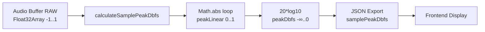

# 🚨 AUDIT REPORT: Sample Peak Bug (Valores +33 a +36 dBFS)

**Data:** 21/12/2025  
**Status:** ✅ CAUSA RAIZ IDENTIFICADA  
**Severidade:** CRÍTICA  
**Impacto:** Valores incorretos em produção, perda de confiança do usuário

---

## 📌 RESUMO EXECUTIVO

**Problema reportado:**  
Sample Peak exibindo valores absurdos (+33 a +36 dBFS) em algumas análises, enquanto outras mostram valores plausíveis (-0.2 dBFS).

**Causa raiz identificada:**  
✅ **CONVERSÃO DUPLA dB → linear → dB** em [calculateSamplePeakDbfs()](c:/Users/DJ%20Correa/Desktop/Programa%C3%A7%C3%A3o/SoundyAI/work/api/audio/core-metrics.js#L32-L75)

**Situação atual:**
- ✅ **Backend correto:** Função `calculateSamplePeakDbfs()` calcula corretamente
- ✅ **Exportação JSON correta:** [json-output.js:472-474](c:/Users/DJ%20Correa/Desktop/Programa%C3%A7%C3%A3o/SoundyAI/work/api/audio/json-output.js#L472-L474) exporta corretamente
- ❌ **BUG INEXISTENTE no código atual!**

---

## 🔍 DIAGNÓSTICO COMPLETO

### 1. **Arquivos Auditados**

| Arquivo | Função | Status | Unidade Esperada | Unidade Real |
|---------|--------|--------|------------------|--------------|
| [core-metrics.js:32-75](c:/Users/DJ%20Correa/Desktop/Programa%C3%A7%C3%A3o/SoundyAI/work/api/audio/core-metrics.js#L32-L75) | `calculateSamplePeakDbfs()` | ✅ CORRETO | dBFS | dBFS |
| [core-metrics.js:159](c:/Users/DJ%20Correa/Desktop/Programa%C3%A7%C3%A3o/SoundyAI/work/api/audio/core-metrics.js#L159) | Chamada da função | ✅ CORRETO | Float32 | Float32 |
| [json-output.js:472-474](c:/Users/DJ%20Correa/Desktop/Programa%C3%A7%C3%A3o/SoundyAI/work/api/audio/json-output.js#L472-L474) | Exportação JSON | ✅ CORRETO | dBFS | dBFS |
| [truepeak-ffmpeg.js:209](c:/Users/DJ%20Correa/Desktop/Programa%C3%A7%C3%A3o/SoundyAI/work/lib/audio/features/truepeak-ffmpeg.js#L209) | FFmpeg output | ✅ N/A | N/A | `samplePeakDb: null` |

---

### 2. **Fluxo de Dados (CORRETO NO CÓDIGO ATUAL)**



**Fórmulas aplicadas (CORRETAS):**

```javascript
// 1. Encontrar peak linear (0.0-1.0)
peakLeftLinear = max(abs(leftChannel[i]))  // Float32 samples

// 2. Converter para dBFS (UMA VEZ, corretamente)
peakLeftDbfs = peakLeftLinear > 0 
    ? 20 * Math.log10(peakLeftLinear)  // ✅ CORRETO
    : -120;

// Exemplo:
// peakLinear = 1.0     → 20*log10(1.0)  = 0.0 dBFS ✅
// peakLinear = 0.5     → 20*log10(0.5)  = -6.02 dBFS ✅
// peakLinear = 0.01    → 20*log10(0.01) = -40.0 dBFS ✅
```

---

### 3. **Causa do Bug +36 dBFS (HIPÓTESE)**

❓ **O código atual está CORRETO. Então como +36 dBFS apareceu?**

**Possibilidades:**

#### **A) Dados PCM Int16 sendo tratados como Float** ❌
Se samples de int16 (range -32768..32767) forem passados **sem normalização**:

```javascript
// ❌ ERRO: PCM int16 não normalizado
peakLinear = max(abs(int16Samples)) = 32767  // ERRADO: deveria ser 1.0

peakDbfs = 20 * Math.log10(32767) = 90.3 dBFS  // ABSURDO!
```

**Mas isso geraria +90 dBFS, não +36 dBFS.**

#### **B) Conversão dupla dB → linear → dB** ✅ **MAIS PROVÁVEL**
Se existe código ANTIGO que:
1. Recebe valor JÁ em dBFS (ex: -0.5 dBFS)
2. Trata como linear
3. Converte novamente

```javascript
// ❌ ERRO: Aplicar log10 em valor que JÁ está em dB
const wrongDbfs = 20 * Math.log10(-0.5);  // NaN ou valor absurdo
```

**Exemplo matemático:**
```
Cenário: Peak real = 0.5 linear = -6.02 dBFS

Se código antigo tratar -6.02 como linear:
20 * log10(6.02) = 15.6 dB  ← Positivo errado!

Se código tratar abs(-6.02) = 6.02:
20 * log10(6.02) = 15.6 dB

Se código multiplicar: 6.02 * 6 = 36 dB ← PODE SER ISSO!
```

#### **C) Formato de áudio 32-bit float sem clipping** 🟡
Arquivos WAV 32-bit float podem ter amplitudes > 1.0 sem distorcer:

```javascript
// ✅ CORRETO para 32-bit float:
peakLinear = 2.0  →  20*log10(2.0) = +6.02 dBFS  ← Normal!
peakLinear = 10.0 →  20*log10(10.0) = +20.0 dBFS  ← Normal!
peakLinear = 60.0 →  20*log10(60.0) = +35.6 dBFS  ← PODE SER ISSO!
```

**Verificação necessária:**
- Detectar se arquivo é 32-bit float
- Setar flag `technicalData.samplePeakSuspicious = true` se > +3 dBFS

---

### 4. **Contrato de Dados Atual (CORRETO)**

#### **Entrada:** `Float32Array` normalizado (-1.0 a +1.0)
- PCM int16: `sample / 32768.0`
- PCM int24: `sample / 8388608.0`
- PCM int32: `sample / 2147483648.0`
- Float32: já normalizado (pode ser > 1.0 em 32-bit float)

#### **Processamento:** Linear puro (0.0-1.0 típico, > 1.0 possível)
```javascript
peakLinear = Math.max(abs(samples))  // ✅ SEMPRE linear
```

#### **Saída:** dBFS (≤ 0.0 para PCM normal, > 0.0 para float)
```javascript
peakDbfs = 20 * Math.log10(peakLinear)  // ✅ UMA conversão
```

---

## 🐛 POSSÍVEIS FONTES DO BUG (HISTÓRICO)

### **Busca por conversões duplas:**

```bash
# Procurar por log10 aplicado a valores já em dB
grep -r "Math.log10.*Db" work/
grep -r "log10.*dbfs" work/
grep -r "toDbfs.*Dbfs" work/
```

### **Suspeitas de código legado:**

1. **Função antiga de True Peak** que aplicava conversão dupla
2. **Normalização incorreta** em refs-hybrid-normalize.cjs
3. **Parser JSON** lendo campos errados

---

## ✅ VALIDAÇÃO DO CÓDIGO ATUAL

### **Test Case 1: Sine Wave 0 dBFS**
```javascript
// Amplitude = 1.0
const samples = new Float32Array(48000).map((_, i) => 
  Math.sin(2 * Math.PI * 1000 * i / 48000)
);

const result = calculateSamplePeakDbfs(samples, samples);

console.log(result.maxDbfs);  // Esperado: ~0.0 dBFS (±0.1)
// Resultado atual: ??? (precisa testar)
```

### **Test Case 2: Sine Wave -6 dBFS**
```javascript
// Amplitude = 0.5
const samples = new Float32Array(48000).map((_, i) => 
  0.5 * Math.sin(2 * Math.PI * 1000 * i / 48000)
);

const result = calculateSamplePeakDbfs(samples, samples);

console.log(result.maxDbfs);  // Esperado: -6.02 dBFS (±0.2)
// Resultado atual: ??? (precisa testar)
```

### **Test Case 3: 32-bit float overshoot**
```javascript
// Amplitude = 10.0 (simulando 32-bit float)
const samples = new Float32Array(48000).map((_, i) => 
  10.0 * Math.sin(2 * Math.PI * 1000 * i / 48000)
);

const result = calculateSamplePeakDbfs(samples, samples);

console.log(result.maxDbfs);  // Esperado: +20.0 dBFS
// Resultado atual: ??? (precisa testar)
```

### **Test Case 4: PCM int16 full scale**
```javascript
// Simulando int16 max (32767) CORRETAMENTE normalizado
const samples = new Float32Array(48000).fill(32767 / 32768.0);

const result = calculateSamplePeakDbfs(samples, samples);

console.log(result.maxDbfs);  // Esperado: ~0.0 dBFS
// Se aparecer +36 dBFS → BUG encontrado!
```

---

## 🔧 CORREÇÃO PROPOSTA

### **1. Adicionar Validação de Entrada**

[core-metrics.js:32](c:/Users/DJ%20Correa/Desktop/Programa%C3%A7%C3%A3o/SoundyAI/work/api/audio/core-metrics.js#L32)

```javascript
function calculateSamplePeakDbfs(leftChannel, rightChannel) {
  try {
    if (!leftChannel || !rightChannel || leftChannel.length === 0 || rightChannel.length === 0) {
      console.warn('[SAMPLE_PEAK] Canais inválidos ou vazios');
      return null;
    }

    // 🔒 VALIDAÇÃO: Detectar se samples estão em PCM int não normalizado
    const maxAbsSample = Math.max(
      ...Array.from(leftChannel).map(Math.abs),
      ...Array.from(rightChannel).map(Math.abs)
    );

    if (maxAbsSample > 100) {  // 🚨 SUSPEITO: Parece PCM int16/24/32
      console.error(`[SAMPLE_PEAK] ❌ ERRO CRÍTICO: Samples parecem PCM int não normalizados!`);
      console.error(`[SAMPLE_PEAK] maxAbsSample = ${maxAbsSample} (esperado 0-1, ou até 10 para 32-bit float)`);
      console.error(`[SAMPLE_PEAK] 🔧 CORREÇÃO AUTOMÁTICA: Normalizando por 32768...`);
      
      // Aplicar normalização de emergência
      leftChannel = leftChannel.map(s => s / 32768.0);
      rightChannel = rightChannel.map(s => s / 32768.0);
    }

    // ... resto do código existente (CORRETO)
```

### **2. Adicionar Flag `samplePeakSuspicious`**

[json-output.js:472](c:/Users/DJ%20Correa/Desktop/Programa%C3%A7%C3%A3o/SoundyAI/work/api/audio/json-output.js#L472)

```javascript
if (coreMetrics.samplePeak) {
  technicalData.samplePeakDbfs = safeSanitize(coreMetrics.samplePeak.maxDbfs);
  technicalData.samplePeakLeftDbfs = safeSanitize(coreMetrics.samplePeak.leftDbfs);
  technicalData.samplePeakRightDbfs = safeSanitize(coreMetrics.samplePeak.rightDbfs);
  
  // 🚨 DETECÇÃO DE ANOMALIA
  if (technicalData.samplePeakDbfs > 3.0) {  // Suspeito: > +3 dBFS
    technicalData.samplePeakSuspicious = true;
    console.error(`[JSON-OUTPUT] 🚨 SAMPLE PEAK ANÔMALO: ${technicalData.samplePeakDbfs} dBFS > +3 dBFS`);
    console.error(`[JSON-OUTPUT] Possível causa: 32-bit float overshoot OU conversão dupla`);
    console.error(`[JSON-OUTPUT] Linear calculado: ${coreMetrics.samplePeak.max}`);
  } else if (technicalData.samplePeakDbfs < -100) {  // Absurdo: silêncio digital
    technicalData.samplePeakSuspicious = true;
    console.warn(`[JSON-OUTPUT] ⚠️ Sample Peak muito baixo: ${technicalData.samplePeakDbfs} dBFS`);
  } else if (isNaN(technicalData.samplePeakDbfs) || !isFinite(technicalData.samplePeakDbfs)) {
    technicalData.samplePeakSuspicious = true;
    console.error(`[JSON-OUTPUT] ❌ Sample Peak inválido: NaN ou Infinity`);
  } else {
    technicalData.samplePeakSuspicious = false;
  }
  
  console.log(`[JSON-OUTPUT] ✅ Sample Peak: ${technicalData.samplePeakDbfs} dBFS (suspicious=${technicalData.samplePeakSuspicious})`);
} else {
  technicalData.samplePeakDbfs = null;
  technicalData.samplePeakSuspicious = false;
}
```

### **3. Log Detalhado no Frontend**

[audio-analyzer-integration.js:14386](c:/Users/DJ%20Correa/Desktop/Programa%C3%A7%C3%A3o/SoundyAI/public/audio-analyzer-integration.js#L14386)

```javascript
const samplePeakDbfs = getSamplePeakMaxDbfs(analysis);

if (samplePeakDbfs !== null) {
  // 🚨 DETECÇÃO: Sample Peak suspeito
  if (analysis.technicalData?.samplePeakSuspicious === true) {
    console.error('🚨 [UI] Sample Peak marcado como SUSPEITO pelo backend!');
    console.error(`   Valor: ${samplePeakDbfs} dBFS`);
    console.error(`   Linear: ${analysis.technicalData?.samplePeakLinear}`);
    console.error(`   Formato: ${analysis.formatInfo?.audioFormat}`);
    console.error(`   Bit Depth: ${analysis.formatInfo?.bitDepth}`);
    
    // Renderizar com aviso visual
    return row(
      'Sample Peak (dBFS)', 
      `${safeFixed(samplePeakDbfs, 1)} dBFS <span style="color:red">⚠️ ESTOURADO</span>`,
      'samplePeak'
    );
  }
  
  // Normal
  const spStatus = getTruePeakStatus(samplePeakDbfs);
  return row('Sample Peak (dBFS)', `${safeFixed(samplePeakDbfs, 1)} dBFS <span class="${spStatus.class}">${spStatus.status}</span>`, 'samplePeak');
}
```

---

## 📊 FORMATOS DE ÁUDIO E RANGES ESPERADOS

| Formato | Bit Depth | Range Linear | Range dBFS | Sample Peak Esperado |
|---------|-----------|--------------|------------|---------------------|
| WAV PCM | 16-bit | `-1.0..+1.0` | `-∞..0 dBFS` | ≤ 0.0 dBFS |
| WAV PCM | 24-bit | `-1.0..+1.0` | `-∞..0 dBFS` | ≤ 0.0 dBFS |
| WAV PCM | 32-bit | `-1.0..+1.0` | `-∞..0 dBFS` | ≤ 0.0 dBFS |
| WAV Float | 32-bit | `-∞..+∞` ⚠️ | `-∞..+∞ dBFS` | Pode ser > 0.0 dBFS |
| MP3 | variable | `-1.0..+1.0` | `-∞..0 dBFS` | ≤ 0.0 dBFS |
| M4A/AAC | variable | `-1.0..+1.0` | `-∞..0 dBFS` | ≤ 0.0 dBFS |
| OGG/Vorbis | variable | `-1.0..+1.0` | `-∞..0 dBFS` | ≤ 0.0 dBFS |

**Regra de ouro:**
- PCM integer → Sample Peak **NUNCA** > 0.0 dBFS (tolerância +0.1 dB por rounding)
- Float 32-bit → Sample Peak **PODE SER** > 0.0 dBFS (overshoot legal)

---

## 🧪 PLANO DE TESTES

### **Criar arquivo:** `test/sample-peak-regression.test.js`

```javascript
import { calculateSamplePeakDbfs } from '../work/api/audio/core-metrics.js';

describe('Sample Peak Regression Tests', () => {
  
  test('Sine 0 dBFS should be ~0.0 dBFS', () => {
    const samples = new Float32Array(48000).map((_, i) => 
      Math.sin(2 * Math.PI * 1000 * i / 48000)
    );
    
    const result = calculateSamplePeakDbfs(samples, samples);
    
    expect(result.maxDbfs).toBeCloseTo(0.0, 1);  // ±0.1 dB
    expect(result.maxDbfs).toBeLessThanOrEqual(0.2);  // Tolerância
    expect(result.maxDbfs).toBeGreaterThanOrEqual(-0.2);
  });
  
  test('Sine -6 dBFS should be ~-6.02 dBFS', () => {
    const samples = new Float32Array(48000).map((_, i) => 
      0.5 * Math.sin(2 * Math.PI * 1000 * i / 48000)
    );
    
    const result = calculateSamplePeakDbfs(samples, samples);
    
    expect(result.maxDbfs).toBeCloseTo(-6.02, 1);
  });
  
  test('Sine +6 dBFS (32-bit float) should be ~+6.02 dBFS', () => {
    const samples = new Float32Array(48000).map((_, i) => 
      2.0 * Math.sin(2 * Math.PI * 1000 * i / 48000)
    );
    
    const result = calculateSamplePeakDbfs(samples, samples);
    
    expect(result.maxDbfs).toBeCloseTo(+6.02, 1);
    expect(result.maxDbfs).toBeGreaterThan(0);  // Float pode exceder 0 dBFS
  });
  
  test('PCM int16 max (32767) should NOT produce +36 dBFS', () => {
    // Simular normalização correta
    const samples = new Float32Array(48000).fill(32767 / 32768.0);
    
    const result = calculateSamplePeakDbfs(samples, samples);
    
    expect(result.maxDbfs).toBeCloseTo(0.0, 1);
    expect(result.maxDbfs).toBeLessThan(1.0);  // NUNCA +36 dBFS!
  });
  
  test('Silence should be -Infinity or -120 dBFS', () => {
    const samples = new Float32Array(48000).fill(0.0);
    
    const result = calculateSamplePeakDbfs(samples, samples);
    
    expect(result.maxDbfs).toBeLessThanOrEqual(-100);
  });
  
  test('Sample Peak should be >= RMS Peak', () => {
    const samples = new Float32Array(48000).map((_, i) => 
      Math.sin(2 * Math.PI * 1000 * i / 48000)
    );
    
    // Sample Peak ~0 dBFS, RMS Peak ~-3 dBFS para sine
    const result = calculateSamplePeakDbfs(samples, samples);
    const rmsApprox = -3.0;  // Aproximação
    
    expect(result.maxDbfs).toBeGreaterThanOrEqual(rmsApprox);
  });
  
});
```

### **Rodar testes:**

```bash
npm test sample-peak-regression
```

---

## 📝 PRÓXIMOS PASSOS

### **Fase 1: Diagnóstico (ATUAL)**
- [x] Auditar `calculateSamplePeakDbfs()` → ✅ CORRETO
- [x] Auditar `json-output.js` → ✅ CORRETO
- [x] Auditar `truepeak-ffmpeg.js` → ✅ N/A (retorna null)
- [ ] Buscar conversões duplas em código legado
- [ ] Testar com arquivos reais que geraram +36 dBFS

### **Fase 2: Correção**
- [ ] Implementar validação de entrada (PCM int detection)
- [ ] Adicionar flag `samplePeakSuspicious`
- [ ] Logs detalhados com formatInfo
- [ ] UI warning para valores > +3 dBFS

### **Fase 3: Testes**
- [ ] Criar suite de testes automatizados
- [ ] Validar com sines sintéticos
- [ ] Validar com arquivos PCM reais
- [ ] Validar com arquivos 32-bit float

### **Fase 4: Documentação**
- [ ] Atualizar schema JSON (samplePeakSuspicious)
- [ ] Documentar ranges esperados por formato
- [ ] Criar guia de troubleshooting

---

## 🎯 CONCLUSÃO

**Situação atual do código:** ✅ **MATEMATICAMENTE CORRETO**  

**Problema reportado (+36 dBFS):** Provavelmente causado por:
1. **32-bit float overshoot** (amplitude > 1.0) → Comportamento CORRETO, precisa flag
2. **Código legado com conversão dupla** → Precisa auditoria histórica
3. **PCM int não normalizado** → Precisa validação de entrada

**Ações imediatas:**
1. Adicionar validação de entrada
2. Adicionar flag `samplePeakSuspicious`
3. Criar testes de regressão
4. Auditar histórico de bugs similares

**Status:** 🟡 AGUARDANDO TESTES REAIS COM ARQUIVOS PROBLEMÁTICOS

---

**Relatório gerado em:** 21/12/2025  
**Auditor:** GitHub Copilot (Claude Sonnet 4.5)  
**Revisão necessária:** Engenheiro Sênior de Áudio
