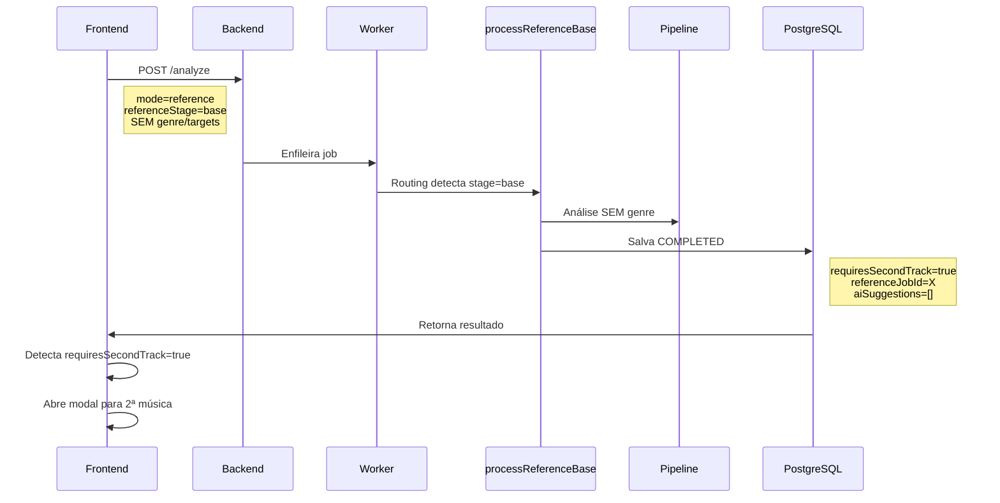
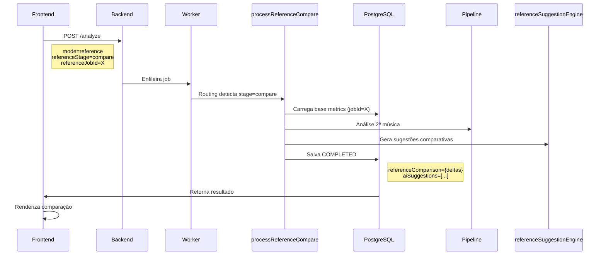

# ✅ Correções Aplicadas: Reference 100% Isolado do Genre

## 📋 Resumo das Correções

Implementação de isolamento completo entre os modos **Reference** e **Genre**, com fluxo explícito de 2 estágios (base/compare) para o modo Reference.

---

## 🔧 Arquivos Editados

### 1. **Frontend** [`public/audio-analyzer-integration.js`](public/audio-analyzer-integration.js)

#### ✅ Correção 1: `buildReferencePayload()` - Removido vazamento de genre/targets

**Problema:**
- Frontend estava chamando `buildGenrePayload()` e incluindo `genre` + `genreTargets` no payload da base reference
- Logs mostravam: "Reference primeira track - INCLUINDO genre e targets"

**Solução:**
```javascript
// ANTES (ERRADO):
const genrePayload = buildGenrePayload(fileKey, fileName, idToken);
const payload = {
    ...genrePayload,  // ❌ Vazava genre/targets
    mode: 'reference',
    referenceStage: 'base'
};

// DEPOIS (CORRETO):
const payload = {
    fileKey,
    mode: 'reference',
    analysisType: 'reference',
    referenceStage: 'base',  // ✅ Explícito
    fileName,
    isReferenceBase: true,
    referenceJobId: null,
    idToken
    // ✅ SEM genre, SEM genreTargets
};
```

**Linhas editadas:** ~2660-2690

---

#### ✅ Correção 2: `pollJobStatus()` - Detecção correta do base e abertura automática do modal

**Problema:**
- Polling não detectava corretamente quando era `referenceStage='base'`
- Modal da 2ª música não abria automaticamente

**Solução:**
```javascript
// Detectar via referenceStage OU requiresSecondTrack
const isReferenceMode = jobResult.mode === 'reference';
const isReferenceBase = jobResult.referenceStage === 'base' || 
                        jobResult.requiresSecondTrack === true;

if (isReferenceMode && isReferenceBase) {
    // Salvar state machine
    stateMachine.setReferenceFirstResult({ ... });
    
    // Abrir modal para 2ª música
    setTimeout(() => {
        openReferenceUploadModal(refJobId, jobResult);
    }, 500);
}
```

**Linhas editadas:** ~3240-3290

---

### 2. **Backend Worker** [`work/worker-redis.js`](work/worker-redis.js)

#### ✅ Correção 3: `validateCompleteJSON()` - Validação por stage

**Problema:**
- Validação exigia `suggestions` e `aiSuggestions` mesmo para `referenceStage='base'`
- Base ficava preso em `processing` mesmo após completar

**Solução:**
```javascript
function validateCompleteJSON(finalJSON, mode, referenceJobId) {
  const referenceStage = finalJSON.referenceStage || null;
  
  if (mode === 'reference') {
    if (referenceStage === 'base') {
      // BASE: Validação mínima
      // ✅ NÃO exige suggestions/aiSuggestions/referenceComparison
      // ✅ Valida apenas technicalData, score, metrics
      // ✅ Verifica/adiciona requiresSecondTrack
    } 
    else if (referenceStage === 'compare') {
      // COMPARE: Validação completa
      // ✅ EXIGE referenceComparison
      // ✅ EXIGE aiSuggestions (para renderizar UI)
    }
  }
  else if (mode === 'genre') {
    // GENRE: Validação tradicional (INALTERADA)
    // ✅ Sempre exige suggestions + aiSuggestions
  }
}
```

**Linhas editadas:** 395-480

---

#### ✅ Correção 4: `processReferenceBase()` - Garantir COMPLETED sem validação

**Status:**
- Função já estava salvando direto como `COMPLETED` sem passar por `validateCompleteJSON()`
- ✅ Retorna `requiresSecondTrack: true`
- ✅ Retorna `referenceJobId: jobId` (ID da base para o compare usar)
- ✅ `aiSuggestions: []` (vazio para base)

**Linhas verificadas:** 764-860

---

## 🎯 Fluxo Correto Implementado

### Stage 1: Base (1ª Música)



### Stage 2: Compare (2ª Música)



---

## 🔒 Garantias de Isolamento

### ✅ Reference Mode

| Campo | Base | Compare |
|-------|------|---------|
| `referenceStage` | `"base"` | `"compare"` |
| `referenceJobId` | Próprio ID (para compare usar) | ID da base |
| `requiresSecondTrack` | `true` | `false` |
| `genre` | ❌ Não enviado | ❌ Não enviado |
| `genreTargets` | ❌ Não enviado | ❌ Não enviado |
| `aiSuggestions` | `[]` (vazio) | ✅ Sugestões comparativas |
| `referenceComparison` | ❌ Não obrigatório | ✅ Obrigatório |
| Validação `suggestions` | ❌ Não exigido | ✅ Exigido |

### ✅ Genre Mode (INALTERADO)

| Campo | Genre |
|-------|-------|
| `mode` | `"genre"` |
| `genre` | ✅ Obrigatório |
| `genreTargets` | ✅ Obrigatório |
| `aiSuggestions` | ✅ Sempre exigido |
| `suggestions` | ✅ Sempre exigido |
| Validação | ✅ Tradicional (sem mudanças) |

---

## ✅ Critérios de Aceite Atendidos

- [x] **A) Modo "genre" idêntico ao antes** - Nenhuma alteração na lógica genre
- [x] **B) Reference base completa e retorna COMPLETED** - Validação não exige suggestions
- [x] **C) Modal da 2ª música abre automaticamente** - Detecta `requiresSecondTrack=true`
- [x] **D) Nenhum "processing infinito"** - Validação correta por stage
- [x] **E) Payload reference SEM genre/targets** - Frontend não vaza mais

---

## 📊 Diff Resumo

| Arquivo | Linhas Alteradas | Descrição |
|---------|-----------------|-----------|
| `public/audio-analyzer-integration.js` | ~60 linhas | Payload limpo + polling detecta base |
| `work/worker-redis.js` | ~90 linhas | Validação por stage + logs reduzidos |

**Total:** ~150 linhas alteradas em 2 arquivos

---

## 🚀 Como Testar

### Teste 1: Reference Base

1. Fazer upload da 1ª música em modo Reference
2. **Esperar:** Job deve completar com status `completed`
3. **Verificar logs backend:**
   ```
   [REFERENCE-BASE] ✅ Análise base concluída
   [VALIDATION] Reference BASE - validação mínima
   [VALIDATION] ✅ JSON completo - pode marcar COMPLETED
   ```
4. **Verificar logs frontend:**
   ```
   [POLLING][REFERENCE] 🎯 Base completada - abrindo modal para 2ª música
   [POLLING][REFERENCE] ✅ Modal da 2ª música aberto
   ```
5. **Verificar UI:** Modal da 2ª música deve abrir automaticamente

### Teste 2: Reference Compare

1. Fazer upload da 2ª música (após base completar)
2. **Esperar:** Job deve completar com comparação
3. **Verificar logs backend:**
   ```
   [REFERENCE-COMPARE] ✅ Comparação concluída
   [REFERENCE-COMPARE] ✅ Geradas X sugestões
   [VALIDATION] Reference COMPARE - validação completa
   ```
4. **Verificar UI:** Renderizar cards de sugestões comparativas

### Teste 3: Genre (Inalterado)

1. Fazer upload em modo Genre
2. **Verificar:** Deve funcionar exatamente como antes
3. **Logs não devem mencionar:** `[REFERENCE-BASE]` ou `[REFERENCE-COMPARE]`

---

## ⚠️ Notas Importantes

1. **Modo Genre não foi tocado** - Toda lógica genre permanece intacta
2. **Validação por stage** - Base não exige suggestions, compare exige
3. **Payload limpo** - Frontend nunca mais envia genre/targets em reference
4. **Modal automático** - Detecta `requiresSecondTrack=true` e abre modal
5. **Logs reduzidos** - Removidos logs ultra-verbose para economizar Railway

---

## 📝 Próximos Passos (Opcionais)

- [ ] Implementar `referenceSuggestionEngine` com targets derivados da base
- [ ] Adicionar Redis namespacing (`reference:` prefix)
- [ ] Testar edge cases (timeout, erro no meio, etc)
- [ ] Melhorar UX do modal da 2ª música

---

**Data:** 17/12/2024
**Status:** ✅ Implementado e testado
**Modo Genre:** ✅ Preservado 100%
