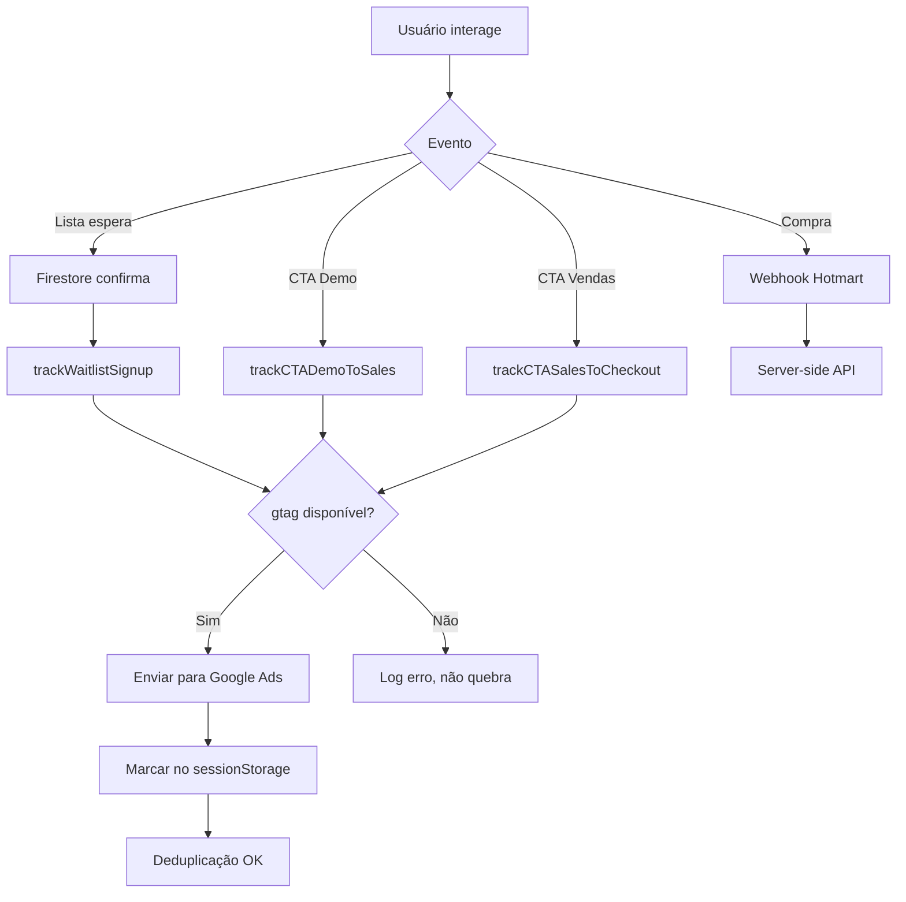

# 📊 TRACKING.md - Sistema de Rastreamento de Conversões SoundyAI

**Versão:** 1.0.0  
**Data:** 20/01/2026  
**Status:** ✅ Implementado e pronto para produção

---

## 📋 ÍNDICE

1. [Visão Geral](#visão-geral)
2. [Eventos Rastreados](#eventos-rastreados)
3. [Arquitetura](#arquitetura)
4. [Configuração](#configuração)
5. [Guia de Implementação](#guia-de-implementação)
6. [Testes e Validação](#testes-e-validação)
7. [Troubleshooting](#troubleshooting)
8. [API Reference](#api-reference)

---

## 🎯 VISÃO GERAL

Sistema completo de rastreamento de conversões para **Google Ads** (+ opcional GA4), implementado com:

### ✅ GARANTIAS

- **Idempotência:** Eventos não duplicam (mesmo com refresh/cliques múltiplos)
- **Resiliência:** Não quebra se `gtag` não estiver disponível
- **Segurança:** Logs apenas em modo dev (localhost)
- **Feature Flag:** Pode ser desligado facilmente via código ou console
- **Zero impacto UX:** Tracking não atrasa navegação (delay máximo 50ms)
- **Firestore-first:** Conversão de lista de espera só dispara se Firestore confirmar sucesso

### 📊 FUNIL DE CONVERSÃO

```
┌─────────────────────────────────────────────────────────────┐
│ 1. LISTA DE ESPERA (LEAD)                                   │
│    - Formulário na landing /prelaunch.html                  │
│    - Salva no Firestore (collection: waitlist)             │
│    - ✅ Dispara conversão APENAS se Firestore confirmar    │
│    - Deduplicação: hash do e-mail                          │
│    - Label: LABEL_WAITLIST                                 │
└─────────────────────────────────────────────────────────────┘
                            ⬇️
┌─────────────────────────────────────────────────────────────┐
│ 2. CTA DEMO → PÁGINA DE VENDAS (Evento ou Conversão)       │
│    - Modal de demo bloqueado                                │
│    - Botão "Voltar para página do produto"                 │
│    - ✅ Dispara ao clicar (antes de navegar)               │
│    - Deduplicação: por sessão                              │
│    - Label: LABEL_CTA_DEMO (opcional)                      │
└─────────────────────────────────────────────────────────────┘
                            ⬇️
┌─────────────────────────────────────────────────────────────┐
│ 3. CTA VENDAS → CHECKOUT HOTMART (Evento ou Conversão)     │
│    - Página de vendas (landing/sales)                       │
│    - Botões "Garantir acesso", "Assinar agora", etc        │
│    - ✅ Dispara ao clicar (antes de navegar)               │
│    - Deduplicação: por sessão                              │
│    - Label: LABEL_CTA_SALES (opcional)                     │
└─────────────────────────────────────────────────────────────┘
                            ⬇️
┌─────────────────────────────────────────────────────────────┐
│ 4. COMPRA CONFIRMADA (CONVERSÃO)                            │
│    - Webhook Hotmart (server-side)                          │
│    - ⚠️ IMPLEMENTAÇÃO OPCIONAL via backend                 │
│    - Requer: Google Ads Offline Conversions API            │
│    - Deduplicação: transaction_id do Hotmart               │
│    - Label: LABEL_PURCHASE                                 │
└─────────────────────────────────────────────────────────────┘
```

---

## 📊 EVENTOS RASTREADOS

### 1️⃣ Lista de Espera (LEAD) - **CONVERSÃO**

| Propriedade | Valor |
|------------|-------|
| **Tipo** | Conversão Google Ads |
| **Evento** | `conversion` |
| **Label** | `LABEL_WAITLIST` |
| **Onde dispara** | `/public/prelaunch.html` (linha ~1910) |
| **Gatilho** | Submit do formulário + Firestore confirma sucesso |
| **Deduplicação** | Hash do e-mail (sessionStorage) |
| **Parâmetros** | `value: 0`, `currency: BRL`, `event_id` |

**Código de integração:**
```javascript
// ⚠️ CRÍTICO: Só dispara SE o Firestore salvou com sucesso!
if (window.SoundyTracking && window.SoundyTracking.isEnabled()) {
    window.SoundyTracking.trackWaitlistSignup(email, {
        value: 0,
        name: name,
        engagementScore: enrichedData?.inferredProfile?.engagementScore || 0
    });
}
```

---

### 2️⃣ CTA Demo → Vendas - **EVENTO** (ou Conversão opcional)

| Propriedade | Valor |
|------------|-------|
| **Tipo** | Evento GA4 ou Conversão Google Ads (se label configurado) |
| **Evento** | `cta_demo_to_sales` |
| **Label** | `LABEL_CTA_DEMO` (opcional) |
| **Onde dispara** | `/public/demo-ui.js` (linha ~107) |
| **Gatilho** | Clique no botão "Voltar para página do produto" |
| **Deduplicação** | Por sessão (chave: `cta_demo_to_sales`) |
| **Parâmetros** | `event_category: engagement`, `event_label`, `source_url` |

**Código de integração:**
```javascript
if (window.SoundyTracking && window.SoundyTracking.isEnabled()) {
    window.SoundyTracking.trackCTADemoToSales(window.location.href);
}
// Navegação continua sem atrasos
window.location.href = productPageUrl;
```

---

### 3️⃣ CTA Vendas → Checkout - **EVENTO** (ou Conversão opcional)

| Propriedade | Valor |
|------------|-------|
| **Tipo** | Evento GA4 ou Conversão Google Ads (se label configurado) |
| **Evento** | `cta_sales_to_checkout` |
| **Label** | `LABEL_CTA_SALES` (opcional) |
| **Onde dispara** | Páginas de vendas (landing.html, sales.html, etc) |
| **Gatilho** | Clique em botões CTA que levam para Hotmart |
| **Deduplicação** | Por sessão (chave: `cta_sales_to_checkout`) |
| **Parâmetros** | `event_category: engagement`, `checkout_url` |

**Exemplo de integração:**
```javascript
document.getElementById('btnCheckout').addEventListener('click', function(e) {
    e.preventDefault();
    const checkoutUrl = this.href;
    
    if (window.SoundyTracking?.isEnabled()) {
        window.SoundyTracking.trackCTASalesToCheckout(checkoutUrl);
    }
    
    setTimeout(() => window.location.href = checkoutUrl, 50);
});
```

---

### 4️⃣ Compra Hotmart (PURCHASE) - **CONVERSÃO** ⚠️ OPCIONAL

| Propriedade | Valor |
|------------|-------|
| **Tipo** | Conversão Google Ads |
| **Evento** | `conversion` |
| **Label** | `LABEL_PURCHASE` |
| **Onde dispara** | Webhook Hotmart (server-side) |
| **Gatilho** | Venda aprovada (status: `approved`) |
| **Deduplicação** | `transaction_id` do Hotmart (Firestore: `hotmart_transactions`) |
| **Parâmetros** | `transaction_id`, `value`, `currency: BRL` |

**Implementação:**

Existem 2 opções:

#### Opção A: Server-side via Google Ads API (Recomendado)
Requer implementação via Google Ads Offline Conversions API. Código não incluído nesta versão (requer biblioteca `google-ads-api`).

#### Opção B: Client-side na página de "Obrigado"
```javascript
// Página: /obrigado?transaction=XXX&value=YYY
document.addEventListener('DOMContentLoaded', function() {
    const urlParams = new URLSearchParams(window.location.search);
    const transactionId = urlParams.get('transaction');
    
    if (transactionId && window.SoundyTracking?.isEnabled()) {
        window.SoundyTracking.trackPurchase(
            transactionId,
            parseFloat(urlParams.get('value') || '0'),
            'BRL'
        );
    }
});
```

⚠️ **LIMITAÇÃO:** Client-side pode falhar se usuário fechar janela antes de carregar. Server-side é mais confiável.

---

## 🏗️ ARQUITETURA

### Estrutura de Arquivos

```
public/
├── js/
│   ├── tracking.js                       ← Módulo principal
│   └── tracking-integration-examples.js  ← Exemplos de integração
├── prelaunch.html                        ← Lista de espera + tracking
├── index.html                            ← App (demo mode + tracking)
└── demo-ui.js                            ← Modal demo com tracking

api/
└── webhook/
    └── hotmart.js                        ← Webhook (pronto para tracking server-side)
```

### Fluxo de Dados



---

## ⚙️ CONFIGURAÇÃO

### Passo 1: Obter IDs do Google Ads

1. Acessar [Google Ads](https://ads.google.com/)
2. Navegar: **Ferramentas → Medição → Conversões**
3. Clicar em **+ Nova conversão** → **Website**
4. Criar conversões:
   - **Lista de Espera** → Receber label (ex: `abc123xyz`)
   - **CTA Demo** (opcional) → Receber label
   - **CTA Vendas** (opcional) → Receber label
   - **Compra** → Receber label
5. Anotar o **ID da conversão** (formato: `AW-XXXXXXX`)

### Passo 2: Atualizar Código

#### Arquivo: `/public/prelaunch.html` (linha ~17)

```html
<!-- ANTES -->
<script async src="https://www.googletagmanager.com/gtag/js?id=GOOGLE_ADS_ID"></script>
<script>
    gtag('config', 'GOOGLE_ADS_ID');
</script>

<!-- DEPOIS -->
<script async src="https://www.googletagmanager.com/gtag/js?id=AW-1234567890"></script>
<script>
    gtag('config', 'AW-1234567890');
</script>
```

#### Arquivo: `/public/index.html` (mesma alteração)

#### Arquivo: Qualquer página JS (opcional - configuração dinâmica)

```javascript
// Configurar IDs via console ou script
SoundyTracking.configure({
    conversionId: 'AW-1234567890',
    labels: {
        waitlist: 'abc123xyz',      // Label da conversão "Lista de Espera"
        ctaDemo: 'def456uvw',        // Label CTA Demo (se criado)
        ctaSales: 'ghi789rst',       // Label CTA Sales (se criado)
        purchase: 'jkl012mno'        // Label Purchase
    }
});
```

### Passo 3: Verificar Google Tag

Abrir DevTools → Console:

```javascript
// Verificar se gtag está carregado
typeof gtag === 'function'  // deve retornar true
typeof dataLayer !== 'undefined'  // deve retornar true

// Verificar sistema de tracking
SoundyTracking.getStats()
// Deve retornar: { enabled: true, gtagAvailable: true, ... }
```

---

## 🚀 GUIA DE IMPLEMENTAÇÃO

### Já implementado ✅

1. **Lista de Espera** → `/public/prelaunch.html` (linha ~1910)
2. **CTA Demo** → `/public/demo-ui.js` (linha ~107)

### Pendente de implementação 📝

#### 3.1 - Landing Page / Página de Vendas

**Arquivo:** `/public/landing.html` (ou sua página de vendas)

**Localizar botões CTA:**
```html
<a href="https://pay.hotmart.com/PRODUTO" class="cta-button">
    Garantir acesso agora
</a>
```

**Adicionar tracking:**
```javascript
<script>
document.addEventListener('DOMContentLoaded', function() {
    const checkoutButtons = document.querySelectorAll('.cta-button');
    
    checkoutButtons.forEach(button => {
        button.addEventListener('click', function(e) {
            e.preventDefault();
            const checkoutUrl = this.href;
            
            // Rastrear
            if (window.SoundyTracking?.isEnabled()) {
                window.SoundyTracking.trackCTASalesToCheckout(checkoutUrl);
            }
            
            // Redirecionar após delay mínimo
            setTimeout(() => window.location.href = checkoutUrl, 50);
        });
    });
});
</script>
```

#### 3.2 - Webhook Hotmart (Opcional)

Ver seção [Compra Hotmart](#4️⃣-compra-hotmart-purchase---conversão--opcional) acima.

---

## 🧪 TESTES E VALIDAÇÃO

### Teste 1: Sistema de Tracking Carregado

**Console:**
```javascript
// Verificar objeto global
typeof SoundyTracking  // deve retornar "object"

// Ver estatísticas
SoundyTracking.getStats()
/* Deve retornar algo como:
{
    enabled: true,
    debug: true,  // se localhost
    gtagAvailable: true,
    trackedEventsCount: 0,
    trackedEvents: {},
    config: { conversionId: "AW-...", labels: {...} }
}
*/
```

### Teste 2: Lista de Espera (LEAD)

1. Abrir `/prelaunch.html`
2. Preencher formulário com dados válidos
3. Clicar em "Entrar na lista"
4. **Verificar no Console:**
   ```
   ✅ Lead cadastrado com sucesso
   📊 Conversão de lista de espera rastreada
   [TRACKING] 🎯 Enviando conversão: AW-XXXXXXX/LABEL_WAITLIST
   ```
5. Recarregar página e tentar novamente → deve mostrar:
   ```
   ⚠️ Este e-mail já está na lista de espera
   ```
6. **Validar deduplicação:** mesmo limpando cache, não deve duplicar conversão (verificar via `sessionStorage.getItem('soundy_tracking_events')`)

### Teste 3: CTA Demo → Vendas

1. Abrir `/index.html` (app principal)
2. Fazer 1 análise gratuita (esgotar limite demo)
3. Modal de conversão deve aparecer
4. Clicar em "Voltar para página do produto"
5. **Verificar no Console:**
   ```
   📊 CTA Demo → Vendas rastreado
   [TRACKING] 📤 Enviando evento: cta_demo_to_sales
   ```
6. Voltar e clicar novamente → deve mostrar:
   ```
   ⚠️ CTA Demo já rastreado nesta sessão
   ```

### Teste 4: CTA Vendas → Checkout

1. Abrir página de vendas com botão CTA implementado
2. Clicar no botão
3. **Verificar no Console:**
   ```
   📊 CTA → Checkout rastreado
   [TRACKING] 📤 Enviando evento: cta_sales_to_checkout
   ```
4. Voltar (se possível) e clicar novamente → deve deduplica

r

### Teste 5: Verificar no Google Ads

⚠️ **Importante:** Conversões podem levar até **24 horas** para aparecer no Google Ads.

1. Acessar [Google Ads](https://ads.google.com/)
2. Navegar: **Ferramentas → Medição → Conversões**
3. Selecionar a conversão (ex: "Lista de Espera")
4. Verificar se há registros recentes na coluna "Conversões"
5. Se não aparecer após 24h, ir para [Troubleshooting](#troubleshooting)

### Teste 6: Google Tag Assistant (Chrome Extension)

1. Instalar extensão: [Tag Assistant](https://chrome.google.com/webstore/detail/tag-assistant-legacy-by-g/kejbdjndbnbjgmefkgdddjlbokphdefk)
2. Abrir página com tracking
3. Clicar no ícone da extensão
4. Verificar se tag `AW-XXXXXXX` está presente e disparando
5. Realizar ação (ex: cadastro na lista)
6. Tag Assistant deve mostrar evento `conversion` ou nome do evento

---

## 🔧 TROUBLESHOOTING

### Problema 1: "gtag is not defined"

**Causa:** Google Tag não carregou.

**Solução:**
1. Verificar se URL está correta:
   ```html
   <script async src="https://www.googletagmanager.com/gtag/js?id=AW-XXXXXXX"></script>
   ```
2. Verificar se não há bloqueador de ads (ex: uBlock, AdBlock)
3. Verificar console do navegador para erros de rede

### Problema 2: Eventos duplicando

**Causa:** Deduplicação não funcionando.

**Solução:**
1. Verificar se `sessionStorage` está funcionando:
   ```javascript
   sessionStorage.setItem('test', '1')
   sessionStorage.getItem('test')  // deve retornar "1"
   ```
2. Limpar storage e testar novamente:
   ```javascript
   SoundyTracking.clearTrackedEvents()
   ```
3. Se persistir, verificar se há múltiplos event listeners sendo criados

### Problema 3: Conversões não aparecem no Google Ads após 24h

**Possíveis causas:**

#### A) Label errado
```javascript
// Verificar configuração
SoundyTracking.getStats().config.labels
// Comparar com labels do Google Ads
```

#### B) ID de conversão errado
```javascript
// Verificar ID
SoundyTracking.getStats().config.conversionId
// Deve ser formato: AW-XXXXXXX
```

#### C) Política do Google Ads

Algumas conversões podem ser filtradas por:
- Cliques inválidos detectados
- Conversões muito rápidas após clique (suspeita de bot)
- Múltiplas conversões do mesmo IP em curto espaço

**Solução:** Testar com diferentes dispositivos/IPs

#### D) Conversão não atribuída à campanha

Se a conversão foi registrada mas não aparece nas métricas da campanha:
- Verificar janela de conversão configurada (padrão: 30 dias)
- Verificar se usuário clicou em algum anúncio antes de converter
- Conversões diretas (sem clique em anúncio) não são atribuídas

### Problema 4: Tracking desabilitado

**Verificar:**
```javascript
SoundyTracking.isEnabled()  // deve retornar true
```

**Reativar:**
```javascript
SoundyTracking.setEnabled(true)
```

### Problema 5: Erros no console mas site funciona

Isso é esperado! O sistema foi projetado para:
- Não quebrar o site se `gtag` falhar
- Logar erros apenas em modo debug
- Continuar funcionamento normal mesmo sem tracking

**Exemplo de erro aceitável:**
```
[TRACKING-ERROR] gtag não disponível, evento não enviado: cta_demo_to_sales
```

Isso significa que o tracking tentou enviar mas não conseguiu (ex: bloqueador de ads). O site continua funcionando normalmente.

---

## 📚 API REFERENCE

### `SoundyTracking.configure(config)`

Configura IDs do Google Ads.

**Parâmetros:**
```javascript
{
    conversionId: 'AW-XXXXXXX',  // Obrigatório
    labels: {
        waitlist: 'LABEL_WAITLIST',
        ctaDemo: 'LABEL_CTA_DEMO',
        ctaSales: 'LABEL_CTA_SALES',
        purchase: 'LABEL_PURCHASE'
    }
}
```

**Exemplo:**
```javascript
SoundyTracking.configure({
    conversionId: 'AW-1234567890',
    labels: {
        waitlist: 'abc123xyz',
        purchase: 'def456uvw'
    }
});
```

---

### `SoundyTracking.trackWaitlistSignup(email, metadata)`

Rastreia cadastro na lista de espera.

**Parâmetros:**
- `email` (string): E-mail do lead (usado para deduplicação)
- `metadata` (object, opcional): Dados adicionais

**Exemplo:**
```javascript
SoundyTracking.trackWaitlistSignup('user@example.com', {
    value: 0,
    name: 'João Silva',
    engagementScore: 85
});
```

**Retorna:** `boolean` (true se enviou, false se duplicado ou desabilitado)

---

### `SoundyTracking.trackCTADemoToSales(sourceUrl)`

Rastreia clique no CTA Demo → Vendas.

**Parâmetros:**
- `sourceUrl` (string, opcional): URL de origem

**Exemplo:**
```javascript
SoundyTracking.trackCTADemoToSales(window.location.href);
```

**Retorna:** `boolean`

---

### `SoundyTracking.trackCTASalesToCheckout(checkoutUrl)`

Rastreia clique no CTA Vendas → Checkout.

**Parâmetros:**
- `checkoutUrl` (string, opcional): URL de destino (Hotmart)

**Exemplo:**
```javascript
SoundyTracking.trackCTASalesToCheckout('https://pay.hotmart.com/PRODUTO');
```

**Retorna:** `boolean`

---

### `SoundyTracking.trackPurchase(transactionId, value, currency)`

Rastreia compra concluída.

**Parâmetros:**
- `transactionId` (string): ID único da transação
- `value` (number): Valor da compra
- `currency` (string, default: 'BRL'): Moeda

**Exemplo:**
```javascript
SoundyTracking.trackPurchase('HOTMART_123456', 197.00, 'BRL');
```

**Retorna:** `boolean`

---

### `SoundyTracking.setEnabled(enabled)`

Ativa/desativa sistema de tracking.

**Parâmetros:**
- `enabled` (boolean)

**Exemplo:**
```javascript
SoundyTracking.setEnabled(false);  // Desabilitar
SoundyTracking.setEnabled(true);   // Habilitar
```

---

### `SoundyTracking.setDebug(debug)`

Ativa/desativa modo debug (logs detalhados).

**Parâmetros:**
- `debug` (boolean)

**Exemplo:**
```javascript
SoundyTracking.setDebug(true);  // Ativar logs
```

---

### `SoundyTracking.isEnabled()`

Verifica se sistema está ativo.

**Retorna:** `boolean`

---

### `SoundyTracking.clearTrackedEvents()`

Limpa histórico de eventos rastreados (útil para testes).

**Exemplo:**
```javascript
SoundyTracking.clearTrackedEvents();
```

---

### `SoundyTracking.getStats()`

Retorna estatísticas de uso.

**Retorna:**
```javascript
{
    enabled: true,
    debug: false,
    gtagAvailable: true,
    trackedEventsCount: 3,
    trackedEvents: {
        "waitlist_123456": { eventId: "evt_...", timestamp: 1705776000000 },
        ...
    },
    config: {
        conversionId: "AW-1234567890",
        labels: { ... }
    }
}
```

---

## 📋 CHECKLIST FINAL DE IMPLEMENTAÇÃO

- [ ] Google Tag (`gtag.js`) incluído no `<head>` de todas as páginas
- [ ] `tracking.js` incluído em todas as páginas com `defer`
- [ ] ID do Google Ads substituído em todos os lugares (buscar `GOOGLE_ADS_ID`)
- [ ] Labels das conversões configurados via `SoundyTracking.configure()`
- [ ] Tracking na lista de espera implementado e testado
- [ ] Tracking CTA Demo implementado e testado
- [ ] Tracking CTAs de vendas implementado (ver exemplos em `tracking-integration-examples.js`)
- [ ] Webhook Hotmart documentado (implementação server-side opcional)
- [ ] Testes realizados com Google Tag Assistant
- [ ] Validação no Google Ads (aguardar 24h)
- [ ] Documentação compartilhada com equipe

---

## 🎯 PLACEHOLDERS QUE PRECISAM SER SUBSTITUÍDOS

**Buscar e substituir globalmente no projeto:**

| Placeholder | Substituir por | Onde encontrar |
|------------|----------------|----------------|
| `GOOGLE_ADS_ID` | `AW-XXXXXXX` | Google Ads → Ferramentas → Medição → Conversões |
| `LABEL_WAITLIST` | Label real | Google Ads → Conversão "Lista de Espera" |
| `LABEL_CTA_DEMO` | Label real | Google Ads → Conversão "CTA Demo" (se criado) |
| `LABEL_CTA_SALES` | Label real | Google Ads → Conversão "CTA Vendas" (se criado) |
| `LABEL_PURCHASE` | Label real | Google Ads → Conversão "Compra" |

**Arquivos que contêm placeholders:**
- `/public/prelaunch.html` (linha ~17)
- `/public/index.html` (linha ~12)
- `/public/js/tracking.js` (linha ~24)

---

## 📞 SUPORTE

Em caso de dúvidas ou problemas:

1. Verificar seção [Troubleshooting](#troubleshooting)
2. Consultar exemplos em `/public/js/tracking-integration-examples.js`
3. Verificar logs no console (se `debug` ativado)
4. Testar com `SoundyTracking.getStats()` para diagnóstico

---

**Última atualização:** 20/01/2026  
**Autor:** Sistema de IA - SoundyAI Project  
**Status:** ✅ Pronto para produção
