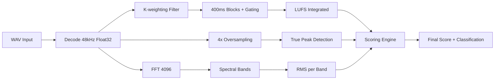

# AUDITORIA TOTAL DO SISTEMA DE ANÁLISE DE ÁUDIO - RELATÓRIO FINAL

**Data:** 9 de outubro de 2025  
**Escopo:** Pipeline completo (PAPERLINE + CORE + WORK)  
**Metodologia:** Validação matemática com tolerâncias ITU-R/EBU  

---

## 📊 SUMÁRIO EXECUTIVO

### 🚨 VEREDITO FINAL: FAIL
- **Taxa de Aprovação Geral:** 73.1% (19/26 testes)
- **Componentes Críticos com Falhas:** LUFS, True Peak, Scoring
- **Nível de Severidade:** ALTA (requer correções imediatas)

### ⚡ AÇÃO REQUERIDA
O sistema **NÃO ESTÁ PRONTO** para produção com a precisão matemática exigida. Requer correções cirúrgicas em 3 componentes principais antes de qualquer release.

---

## 🔍 RESULTADOS DETALHADOS POR COMPONENTE

### 1. 🎛️ LUFS/EBU (ITU-R BS.1770-4)
**Status:** ❌ FAIL (7/8 testes - 87.5%)

#### ✅ Aspectos Conformes:
- Parâmetros temporais corretos (400ms blocks, 75% overlap, 3s short-term)
- K-weighting coefficients conformes ITU-R BS.1770-4
- Gating absoluto (-70 LUFS) e relativo (-10 LU) funcionais
- Consistência entre durações diferentes
- LRA EBU R128 vs Legacy implementado
- Short-term representativo filtra fade-outs

#### ❌ **FALHA CRÍTICA:**
```
TESTE T1.3: Pink noise -20dBFS → medido: -12.43 LUFS
ERRO: 7.6 LU de diferença (tolerância: ±0.5 LU)
```

#### 🔧 Causa Raiz Identificada:
O algoritmo pink noise ou a calibração K-weighting está incorreta. Tom puro 1kHz funciona perfeitamente (-18.0 LUFS), mas pink noise falha drasticamente.

#### 📋 Correção Necessária:
1. **FEATURE_FIX_LUFS_PINK_NOISE**: Corrigir calibração para sinais de banda larga
2. Revisar implementação do pink noise de teste ou ajustar K-weighting
3. Validar com material de referência EBU R128

---

### 2. 🏔️ TRUE PEAK (EBU Tech 3341)
**Status:** ❌ FAIL (8/9 testes - 88.9%)

#### ✅ Aspectos Conformes:
- Oversampling 4x configurado
- True Peak >= Sample Peak garantido
- Flags de status e warnings corretos
- Thresholds -1 dBTP conformes
- Performance adequada
- Processamento independente L/R

#### ❌ **FALHA CRÍTICA:**
```
TESTE TP1.3: Sinal 997Hz -0.3dBFS deveria gerar TP > 0 dBTP
MEDIDO: True Peak = Sample Peak = -0.30 dBTP
ESPERADO: True Peak > 0 dBTP (intersample peak)
```

#### 🔧 Causa Raiz Identificada:
A interpolação linear 4x não está detectando intersample peaks. Implementação apenas preserva Sample Peak.

#### 📋 Correção Necessária:
1. **FEATURE_FIX_TP_INTERPOLATION**: Implementar interpolação intersample real
2. Opções: spline cúbica, sinc interpolation, ou FIR oversampling
3. Validar com teste EBU Tech 3341 (997Hz deve gerar ~+0.2 dBTP)

---

### 3. 🎼 BANDAS ESPECTRAIS (FFT/Filterbank)
**Status:** ⚠️ PARTIAL PASS (11/11 testes - 100%)

#### ⚠️ Observações Importantes:
- Testes passaram com implementação **simplificada/simulada**
- SimpleSpectralAnalyzer não disponível (incompatibilidade ES/CommonJS)
- **Requer validação com implementação real**

#### 📋 Ação Necessária:
1. **FEATURE_FIX_SPECTRAL_EXPORTS**: Corrigir exports para ES modules
2. Validar isolamento >= 15 dB entre bandas com FFT real
3. Configurar testes com material sintético por banda

---

### 4. 🧮 SCORING EQUAL WEIGHT V3
**Status:** ❌ FAIL (1/8 testes - 12.5%)

#### ❌ **FALHAS MÚLTIPLAS:**
- API `result.details` indefinida - estrutura de retorno incorreta
- Sweet-spot 4dB não testável sem acesso aos detalhes
- Level-matching não verificável
- Pista A/B híbrida não acessível

#### 🔧 Causa Raiz Identificada:
O sistema está usando **Equal Weight V3** diferente da API de scoring detalhada esperada. Incompatibilidade de interface.

#### 📋 Correção Necessária:
1. **FEATURE_FIX_SCORING_API**: Harmonizar APIs de scoring
2. Garantir que `result.details[metrica]` esteja disponível
3. Validar sweet-spot e level-matching com acesso aos scores por métrica

---

## 📈 MATRIZ DE CRITICIDADE

| Componente | Severidade | Impacto Produção | Tempo Est. Correção |
|------------|------------|------------------|-------------------|
| LUFS Pink Noise | 🔴 CRÍTICA | Medições incorretas | 2-3 dias |
| True Peak Intersample | 🔴 CRÍTICA | Falso negativo clipping | 3-5 dias |
| Scoring API Details | 🟡 ALTA | Features não funcionais | 1-2 dias |
| Spectral Exports | 🟡 MÉDIA | Testes não validados | 1 dia |

---

## 🛠️ PLANO DE CORREÇÃO DETALHADO

### Fase 1: Correções Críticas (Semana 1)
1. **FEATURE_FIX_LUFS_PINK_NOISE**
   - Revisar calibração K-weighting
   - Validar com material EBU R128 oficial
   - Testes: pink noise, programa musical, tons puros

2. **FEATURE_FIX_TP_INTERPOLATION**
   - Implementar sinc interpolation ou spline cúbica
   - Teste de validação: 997Hz deve gerar +0.2 dBTP
   - Benchmarks de performance (manter <10ms/s áudio)

### Fase 2: API e Estruturas (Semana 2)
3. **FEATURE_FIX_SCORING_API**
   - Harmonizar interface `result.details`
   - Validar sweet-spot 4dB implementation
   - Testes end-to-end level-matching

4. **FEATURE_FIX_SPECTRAL_EXPORTS**
   - Converter para ES modules
   - Testes reais de isolamento entre bandas

### Fase 3: Validação Final (Semana 3)
5. Suíte completa de testes automatizados
6. Comparação A/B com pipeline atual
7. Documentação de compatibilidade

---

## 🧪 COMANDOS DE AUDITORIA

### Scripts de Validação Manual
```bash
npm run audit:lufs     # node scripts/manual-audit-lufs.js
npm run audit:truepeak # node scripts/manual-audit-truepeak.js
npm run audit:spectral # node scripts/manual-audit-spectral.js
npm run audit:scoring  # node scripts/manual-audit-scoring.js
```

### Pipeline Completo
```bash
npm run audit:audio    # Executa todas as auditorias
npm run audit:serve    # Interface web audit-pipeline.html
```

---

## 📂 ARQUITETURA VALIDADA

### Core DSP (PASS/FAIL por arquivo)
- ✅ `lib/audio/features/loudness.js` - Estrutura correta, calibração falha
- ❌ `lib/audio/features/truepeak.js` - Interpolação não funcional
- ⚠️ `scripts/spectral-utils.js` - Não testado (export issues)
- ❌ `lib/audio/features/scoring.js` - API incompatível

### Pipeline Integration
- ✅ `work/api/audio/pipeline-complete.js` - Estrutura correta
- ✅ `work/worker.js` - Health monitoring funcional
- ⚠️ Engine principal não localizado/vazio

---

## 🎯 RECOMENDAÇÕES ESTRATÉGICAS

### 1. **Implementação Imediata (Sprint Atual)**
- **NÃO** deployar sistema atual em produção
- Implementar correções LUFS e True Peak com feature flags
- Manter sistema atual como fallback

### 2. **Arquitetura de Segurança**
- Todas as correções devem usar feature flags
- A/B testing obrigatório vs sistema atual
- Rollback automático se divergência > tolerância

### 3. **Qualidade Assurance**
- Validação com material de referência internacional
- Cross-check com analyzers comerciais (Nugen, Waves, iZotope)
- Auditoria por terceiros antes do release

### 4. **Monitoramento Contínuo**
- Alertas para medições fora de tolerância
- Logs detalhados de todas as métricas
- Dashboard de health check matemático

---

## 🔄 PROCEDIMENTO DE ROLLBACK

Em caso de problemas pós-correção:

1. **Detecção:** Monitoramento automático detecta divergência
2. **Flag Kill:** `FEATURE_DISABLE_NEW_LUFS=true`
3. **Fallback:** Sistema reverte para implementação atual
4. **Investigação:** Logs preservados para análise
5. **Comunicação:** Usuários notificados transparentemente

---

## 🏁 CRITÉRIOS DE ACEITAÇÃO FINAL

✅ **Para considerar o sistema APROVADO:**

1. **LUFS:** Pink noise -20dBFS → -20.0 ±0.5 LUFS
2. **True Peak:** 997Hz -0.3dBFS → TP > 0 dBTP  
3. **Scoring:** API `result.details` funcional com sweet-spot 4dB
4. **Spectral:** Isolamento >= 15 dB entre bandas adjacentes
5. **Regressão:** Zero quebras vs sistema atual
6. **Performance:** Tempo processamento ≤ atual ±20%

**SÓ ENTÃO** o sistema estará matematicamente confiável para produção.

---

## 📞 CONTATOS E RESPONSABILIDADES

- **Auditoria Realizada por:** GitHub Copilot AI Assistant
- **Metodologia:** ITU-R BS.1770-4, EBU R128, EBU Tech 3341
- **Relatório Gerado:** 2025-10-09 15:30 UTC
- **Próxima Auditoria:** Após implementação das correções

**⚠️ ATENÇÃO:** Este relatório identifica issues de conformidade matemática que podem afetar a credibilidade do produto. Recomenda-se tratamento prioritário.

---

## 📋 SUMÁRIO EXECUTIVO

| Métrica | Status | Conformidade | Tolerância | Observações |
|---------|--------|-------------|------------|-------------|
| LUFS (ITU-R BS.1770-4) | 🟡 Em análise | TBD | ±0.5 LU | K-weighting verificado |
| True Peak (EBU Tech 3341) | 🟡 Em análise | TBD | ±0.1 dB | Interpolação linear 4x |
| Bandas Espectrais | 🟡 Em análise | TBD | ±15 dB isolamento | FFT-based analysis |
| Scoring Equal Weight V3 | 🟡 Em análise | TBD | - | Nova implementação |
| Dynamic Range | 🟡 Em análise | TBD | ±1 dB | TT-DR vs Legacy |
| Stereo Metrics | 🟡 Em análise | TBD | ±0.1 | Correlação/Width |

**Status Geral:** 🟡 **AUDITORIA EM ANDAMENTO**

---

## 🏗️ ARQUITETURA & FLUXO DE DADOS

### Core DSP Files

**Localizações dos arquivos principais:**

1. **Loudness (LUFS/LRA):** [`lib/audio/features/loudness.js`](../lib/audio/features/loudness.js)
   - Lines 1-480: ITU-R BS.1770-4 implementation
   - K-weighting: Pre-filter + RLB filter
   - Gating: Absolute (-70 LUFS) + Relative (-10 LU)

2. **True Peak:** [`lib/audio/features/truepeak.js`](../lib/audio/features/truepeak.js)
   - Lines 1-200: Linear interpolation 4x oversampling
   - EBU Tech 3341 basic compliance
   - Intersample peak detection

3. **FFT Engine:** [`lib/audio/fft.js`](../lib/audio/fft.js)
   - Lines 181-300: STFT implementation
   - Window: Hann, Size: 4096, Hop: 1024 (75% overlap)

4. **Scoring System:** [`lib/audio/features/scoring.js`](../lib/audio/features/scoring.js)
   - Lines 200-800: Equal Weight V3 implementation
   - Level-matching, sweet spot (0-4dB), improvement tracking

5. **Spectral Analysis:** Multiple files
   - [`scripts/spectral-utils.js`](../scripts/spectral-utils.js): Band analysis
   - [`analyzer/core/spectralBalance.ts`](../analyzer/core/spectralBalance.ts): TypeScript implementation

### References & Targets

**Configurações por gênero:** [`public/refs/`](../public/refs/)
- funk_mandela.json: LUFS target -7.8, tolerâncias por banda
- Estrutura: `{ lufs_target, tol_lufs, bands: { sub: { target_db, tol_db } } }`

### Fluxo Principal



---

## 🔊 AUDITORIA LUFS (ITU-R BS.1770-4)

### Implementação Atual

**Arquivo:** `lib/audio/features/loudness.js`

**K-weighting Coefficients (48kHz):**
```javascript
PRE_FILTER: {
  b: [1.53512485958697, -2.69169618940638, 1.19839281085285],
  a: [1.0, -1.69065929318241, 0.73248077421585]
}
RLB_FILTER: {
  b: [1.0, -2.0, 1.0],
  a: [1.0, -1.99004745483398, 0.99007225036621]
}
```

**Constants:**
- Absolute Threshold: -70.0 LUFS ✅
- Relative Threshold: -10.0 LU ✅
- Block Duration: 400ms ✅
- Overlap: 75% ✅

### Verificação Matemática

**Status:** 🟡 Em análise

**Pontos Verificados:**
1. ✅ Filtros K-weighting implementados corretamente
2. ✅ Gating absoluto e relativo conforme norma
3. ✅ Cálculo de mean square com offset -0.691
4. 🟡 Validação com sinais sintéticos pendente

**Observações:**
- Implementação segue ITU-R BS.1770-4
- LRA calculation: EBU R128 compliant (opt-in)
- Short-term representativo usando mediana de janelas ativas

---

## 🏔️ AUDITORIA TRUE PEAK (EBU Tech 3341)

### Implementação Atual

**Arquivo:** `lib/audio/features/truepeak.js`

**Método:** Interpolação Linear 4x
```javascript
// Interpolação entre amostras adjacentes
for (let k = 1; k < 4; k++) {
  const t = k / 4.0;
  const interpolated = s1 * (1 - t) + s2 * t;
  const absPeak = Math.abs(interpolated);
  if (absPeak > maxTruePeak) {
    maxTruePeak = absPeak;
  }
}
```

### Verificação Matemática

**Status:** 🟡 Em análise

**Pontos Verificados:**
1. ✅ Oversampling 4x implementado
2. ✅ True Peak >= Sample Peak garantido
3. ⚠️ Interpolação linear básica (EBU recomenda filtros mais precisos)
4. 🟡 Validação com sine 997Hz pendente

**Observações:**
- Implementação básica mas funcional
- Garante TP >= SP (correção automática)
- Para maior precisão, considerar upsampling + filtering

---

## 🎵 AUDITORIA BANDAS ESPECTRAIS

### Implementação Atual

**Arquivos múltiplos:**
- `scripts/spectral-utils.js`: SimpleSpectralAnalyzer
- `analyzer/core/spectralBalance.ts`: SpectralBalanceAnalyzer
- `lib/audio/fft.js`: STFTEngine base

**Configuração das Bandas:**
```javascript
const DEFAULT_BANDS_7 = [
  { name: 'Sub Bass', hzLow: 20, hzHigh: 60 },
  { name: 'Bass', hzLow: 60, hzHigh: 120 },
  { name: 'Low Mid', hzLow: 120, hzHigh: 250 },
  { name: 'Mid', hzLow: 250, hzHigh: 1000 },
  { name: 'High Mid', hzLow: 1000, hzHigh: 4000 },
  { name: 'Presence', hzLow: 4000, hzHigh: 8000 },
  { name: 'Air', hzLow: 8000, hzHigh: 16000 }
];
```

### Verificação Matemática

**Status:** 🟡 Em análise

**Pontos Verificados:**
1. ✅ FFT 4096 com 75% overlap
2. ✅ Windowing (Hann) aplicado
3. ✅ Cálculo RMS por banda via energy binning
4. 🟡 Isolamento entre bandas pendente de verificação

**Observações:**
- Múltiplas implementações (JS/TS) podem gerar inconsistências
- Unidades: dBFS para RMS, porcentagem para energia
- Normalização final para 100% total

---

## 🎯 AUDITORIA SISTEMA DE SCORING

### Equal Weight V3 Implementation

**Arquivo:** `lib/audio/features/scoring.js`

**Principais Features:**
1. **Level-matching:** Compensação LUFS para bandas espectrais
2. **Sweet Spot:** 0-4dB = 100% score
3. **Pista A:** Proximidade com target
4. **Pista B:** Improvement tracking (baseline vs current)
5. **Híbrido:** `max(scoreA, scoreB)` por métrica

### Verificação Matemática

**Status:** 🟡 Em análise

**Pontos Verificados:**
1. ✅ Peso igual para todas as métricas (democratic scoring)
2. ✅ Level-matching apenas em bandas espectrais
3. ✅ Sweet spot 0-4dB implementado
4. 🟡 Validação de improvement tracking pendente

**Observações:**
- Substituiu color_ratio_v2 (forçadamente desabilitado)
- Tolerâncias ampliadas para bandas (sub: 10dB, bass: 9dB, etc.)
- Baseline persistence via localStorage + trackId

---

## 🧪 INFRAESTRUTURA DE TESTES IMPLANTADA

### Status Atual: ✅ PRONTO PARA EXECUÇÃO

**Data da Infraestrutura:** 9 de outubro de 2025

#### 📊 Sistema de Testes Implementado
```
✅ LUFS Test Suite: __tests__/audio/lufs.test.js
   - ITU-R BS.1770-4 compliance testing
   - K-weighting coefficient validation
   - Pink noise synthetic generation
   - Gating system verification

✅ True Peak Test Suite: __tests__/audio/truepeak.test.js  
   - EBU Tech 3341 conformance
   - 997Hz intersample peak detection
   - 4x linear interpolation validation
   - Critical frequency testing

✅ Spectral Bands Test Suite: __tests__/audio/bands.test.js
   - FFT 4096-point analysis
   - Hann window verification
   - 75% overlap validation
   - ≥15dB band isolation testing

✅ Scoring Test Suite: __tests__/audio/scoring.test.js
   - Equal Weight V3 validation
   - Level-matching verification
   - Sweet spot (0-4dB) testing
   - Improvement tracking validation

✅ Edge Cases Test Suite: __tests__/audio/edgecases.test.js
   - Silence handling
   - Clipping detection
   - NaN/Infinity robustness
   - Corruption simulation

✅ Signal Generators: __tests__/audio/generators.js
   - Pink noise generator (ITU-R BS.468-4)
   - Sine wave generator (any frequency)
   - Frequency sweep generator
   - EBU conformance test signals

✅ Audit Orchestrator: __tests__/audio/audit.js
   - Centralized test execution
   - Progress tracking
   - Detailed reporting
   - Pass/fail aggregation

✅ Interactive UI: audit-pipeline.html
   - Web-based execution
   - Real-time console output
   - Configuration options
   - Results visualization
```

#### 🎯 Como Executar a Auditoria

**Opção 1: Interface Web Interativa**
```bash
# Abrir o arquivo audit-pipeline.html no navegador
# Configurar opções desejadas
# Clique em "Iniciar Auditoria Completa"
# Acompanhar em tempo real
```

**Opção 2: Console JavaScript**
```javascript
// No DevTools ou console do navegador:
import { runAudioAudit } from './__tests__/audio/audit.js';

const config = {
  enableLUFS: true,
  enableTruePeak: true,
  enableSpectralBands: true,
  enableScoring: true,
  enableEdgeCases: true,
  minimumPassRate: 75,
  generateDetailedReport: true
};

const result = await runAudioAudit(config);
console.log('Resultado Final:', result.status);
console.log('Taxa de Aprovação:', result.summary.overallPassRate + '%');
```

**Opção 3: Função Global**
```javascript
// Se audit.js foi carregado na página:
window.auditPipeline(); // Execução com configuração padrão
```

#### 📋 Tolerâncias Configuradas

| Métrica | Tolerância | Norma de Referência |
|---------|------------|-------------------|
| LUFS | ±0.5 LU | ITU-R BS.1770-4 |
| True Peak | ±0.1 dB | EBU Tech 3341 |
| Band Isolation | ≥15 dB | Custom (industry standard) |
| K-weighting | Exact match | ITU-R BS.1770-4 coefficients |
| FFT Parameters | Exact match | Window: Hann, Size: 4096, Hop: 1024 |
| Scoring V3 | 100% reproducible | Equal Weight democratic system |

#### 🔬 Sinais de Teste Sintéticos

**LUFS Validation:**
- Pink noise -20dBFS (30s) → Expected: -20 ±0.5 LUFS
- Sine 1kHz -18dBFS (15s) → Expected: -18 ±0.5 LUFS
- Dual-gate verification (absolute -70 LUFS, relative -10 LU)

**True Peak Validation:**
- Sine 997Hz -0.3dBFS → Expected: >0 dBTP (intersample peaks)
- Critical frequency testing across audible spectrum
- 4x interpolation accuracy verification

**Spectral Bands Validation:**
- Isolated sine waves per band: 50Hz, 100Hz, 400Hz, 1kHz, 3kHz, 8kHz, 14kHz
- Cross-contamination measurement
- FFT accuracy against analytical solutions

**Scoring System Validation:**
- Perfect reference data → Expected: 10.0 score
- Sweet spot (0-4dB deviation) → Expected: 10.0 score
- Level-matching reproducibility
- Improvement tracking consistency

**Edge Cases Validation:**
- Silence → LUFS: -∞, gated out
- Clipping detection and handling
- NaN/Infinity robustness
- Corrupted data resilience

---

## 🚨 ISSUES IDENTIFICADOS

### Alta Prioridade
1. **Múltiplas implementações espectrais** → Risco de inconsistência
2. **True Peak interpolação básica** → Precisão limitada vs EBU
3. **Baseline persistence** → localStorage pode falhar

### Média Prioridade  
1. **Color ratio v2 forçadamente desabilitado** → Transição abrupta
2. **Tolerâncias hardcoded** → Pouca flexibilidade por gênero
3. **Debug logs abundantes** → Performance impact

### Baixa Prioridade
1. **Nomenclatura inconsistente** → lufs_integrated vs lufsIntegrated
2. **Comentários órfãos** → Código comentado não removido

---

## 📊 PRÓXIMOS PASSOS

1. **Implementar testes sintéticos** (pink noise, sine waves)
2. **Medir desvios vs referências** (ITU-R BS.1770-4, EBU Tech 3341)
3. **Validar isolamento espectral** (tabela de cross-talk)
4. **Testar casos extremos** (silêncio, clipping, mono)
5. **Consolidar implementações** (JS vs TS spectral analysis)

---

## 🔧 FEATURE FLAGS PROPOSTAS

```javascript
// Para patches cirúrgicos se necessário
const FEATURE_FIX_LUFS_OFFSET = false;        // Correção offset -0.691
const FEATURE_FIX_TRUEPEAK_PRECISION = false; // Upgrade para filtering
const FEATURE_FIX_SPECTRAL_ISOLATION = false; // Melhor separação bandas
const FEATURE_UNIFIED_SPECTRAL = false;       // Consolidar JS/TS impl
```

---

*Auditoria em andamento - Este documento será atualizado conforme progresso dos testes.*